# Enterprise Data Pipeline Anatomy: Batch vs Streaming, Medallion Architecture, and Lineage

In modern enterprise data systems, a **Data Pipeline** is the automated computing infrastructure that extracts raw data from operational systems, cleanses and shapes it, enforces regulatory controls, and lands it into analytics and AI stores.

---

## 1. Batch vs Streaming Data Pipelines

A foundational engineering trade-off is choosing between **Batch Processing** and **Streaming Processing**:

| Characteristic | Batch Processing (e.g., Daily Ingestion) | Streaming Processing (e.g., Kafka / Flink) |
|---|---|---|
| **Data Scope** | Fixed, bounded datasets processed in chunks | Unbounded continuous event streams |
| **Latency** | Minutes, hours, or overnight batches | Milliseconds to sub-second |
| **Cost & Complexity** | Lower infrastructure footprint, simple retries | High infrastructure complexity, stateful buffering |
| **Reconciliation** | Exact mathematical balancing (`Input == Output`) | Complex watermarking, out-of-order event handling |
| **Primary Use Case** | Daily reporting, auditing, ML training, billing | Fraud alerts, real-time telemetry, live dashboards |

In Week 2, our Case Management pipeline implements a **micro-batch / scheduled batch architecture** supporting both **Full Reload** and **Incremental High-Watermark Delta Processing**.

---

## 2. The Medallion Architecture (Bronze -> Silver -> Gold)

First popularized by Databricks, the **Medallion Architecture** organizes data lakehouses and warehouses into three distinct quality layers:

```mermaid
graph LR
    subgraph Bronze ["Raw / Bronze Layer"]
        B1["• Append-only immutable store"]
        B2["• Preserves source data verbatim"]
        B3["• Ingest timestamp & source lineage"]
    end

    subgraph Silver ["Standardized / Silver Layer"]
        S1["• Validated schema & standardized types"]
        S2["• Quarantined defective records"]
        S3["• Deduplicated primary keys"]
    end

    subgraph Gold ["Curated / Gold Layer"]
        G1["• Business-ready enriched models"]
        G2["• Joined with reference & SLA policies"]
        G3["• Aggregated analytical summaries"]
    end

    Bronze --> Silver --> Gold
```



### 1. Raw Layer (Bronze)
- **Design Principle**: Capture reality without loss.
- **Rule**: Never mutate raw data. Store files as landed (or compressed Parquet) with metadata columns: `_source_file`, `_ingested_at`, `_run_id`.
- **Why**: If a bug is discovered in business logic 6 months later, you can reprocess all history from Bronze without bothering operational source databases.

### 2. Standardized Layer (Silver)
- **Design Principle**: Cleansed, validated, and normalized single source of truth.
- **Actions**:
  - Cast string columns to strict types (e.g., ISO-8601 UTC datetimes, integer IDs).
  - Strip whitespace, capitalize categorical enums (`OPEN`, `RESOLVED`).
  - Divert records failing critical quality rules to a **Quarantine Dead-Letter Sink**.
  - Deduplicate records keeping the latest updated state.

### 3. Curated Layer (Gold)
- **Design Principle**: Consumable by business analysts, BI dashboards, and AI models.
- **Actions**:
  - Denormalize and enrich with dimensional tables (e.g., lookup department name, employee tier).
  - Calculate business domain metrics (e.g., `resolution_time_hours`, `sla_breached`).
  - Compute pre-aggregated executive rollups (e.g., SLA compliance percentage by department).

---

## 3. Data Lineage & Provenance

**Data Lineage** answers a critical audit question: *Where did this data point come from, and what operations were performed on it between source and destination?*

An enterprise pipeline tracks lineage at two levels:
1. **Dataset Lineage**: Which upstream tables/files fed which downstream tables/files?
2. **Execution Lineage**: What specific pipeline run, code commit, batch ID, and timestamp generated this specific partition?

In our pipeline, lineage is recorded in every execution manifest:
```json
{
  "run_id": "RUN_20260916_120000",
  "batch_id": "BATCH_20260916_1200",
  "sources_ingested": [
    {"source": "cases_csv", "format": "CSV", "count": 20},
    {"source": "reference_json", "format": "JSON", "count": 13}
  ],
  "output_locations": {
    "raw_file": "data/raw/cases/ingest_date=2026-09-16/raw_cases.parquet",
    "standardized_file": "data/standardized/cases/std_cases.parquet",
    "curated_file": "data/curated/cases/curated_cases.parquet"
  }
}
```

---

## 4. Key Takeaway for Engineers

> A pipeline is not just a Python script that transforms data. A production data pipeline is an **auditable state machine** that guarantees data contract compliance, captures every defect into quarantine, balances mathematical counts, and leaves an immutable audit trail.
