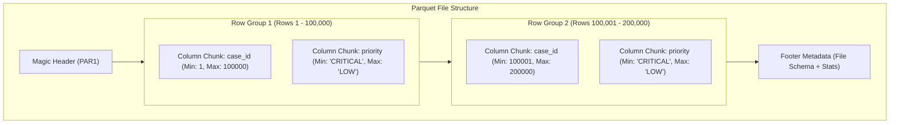

# Data Formats Deep Dive: Apache Parquet, Columnar Storage, and Predicate Pushdown

**Apache Parquet** is the open-source, de facto industry standard file format for analytics, lakehouses, and big data engines (Spark, Snowflake, BigQuery, DuckDB, Trino).

---

## 1. Row-Oriented vs Columnar Storage

Understanding why Parquet is preferred over CSV/JSON requires examining disk layout:

```
Row-Oriented Layout (CSV, PostgreSQL, SQLite):
[Row 1: Case 1, 'Login bug', 'HIGH', 'OPEN'] [Row 2: Case 2, 'Slow query', 'LOW', 'CLOSED'] ...

Columnar Layout (Apache Parquet):
[Col 'case_id': 1, 2, 3, ...]
[Col 'title': 'Login bug', 'Slow query', ...]
[Col 'priority': 'HIGH', 'LOW', ...]
[Col 'status': 'OPEN', 'CLOSED', ...]
```

### Why Columnar Wins for Analytics:
1. **Projection Pruning**: If your query runs `SELECT priority, count(*) FROM cases GROUP BY priority`, a row-based system reads all columns (including massive text descriptions) from disk. Parquet reads **only** the `priority` column bytes.
2. **Extreme Compression**: Identical data types sit next to each other on disk. Repeating strings (e.g. `'OPEN'`, `'CLOSED'`) can be dictionary-encoded and compressed using Snappy or ZSTD, often achieving **70% to 90% space reduction** compared to CSV.
3. **Embedded Strongly-Typed Metadata**: Parquet files store explicit Apache Arrow schemas. There is no guessing whether `'2026-03-01'` is a string or a timestamp—the binary metadata declares it.

---

## 2. Parquet File Anatomy & Predicate Pushdown

A Parquet file consists of:
- **Header**: Magic bytes `PAR1`.
- **Row Groups**: Logical horizontal partitions of rows (typically 64 MB to 512 MB).
- **Column Chunks**: The data for a specific column within a row group, divided into Pages.
- **Footer**: Embedded metadata containing the schema, row counts, and **Column Statistics** (`min_value`, `max_value`, `null_count`).



### What is Predicate Pushdown?
When executing `SELECT * FROM cases WHERE case_id = 150000`, the query engine reads the footer metadata first. Seeing that Row Group 1 has `max_value = 100000`, the engine completely skips reading Row Group 1 from disk. This reduces disk I/O and network transfer by orders of magnitude.

---

## 3. Production Parquet Ingestion & Writing in Our Pipeline

We use `pyarrow` and `pandas` for reading and writing Parquet:

```python
import pyarrow.parquet as pq
import pandas as pd
from pathlib import Path

# Ingesting Parquet with column projection
def read_parquet_columns(file_path: Path, columns: list[str]) -> pd.DataFrame:
    """Reads only specified columns directly from Parquet without scanning whole file."""
    table = pq.read_table(file_path, columns=columns)
    return table.to_pandas()

# Publishing Curated Parquet with Snappy compression
def write_curated_parquet(df: pd.DataFrame, output_path: Path) -> None:
    """Writes standardized DataFrame to Parquet with optimal analytics settings."""
    output_path.parent.mkdir(parents=True, exist_ok=True)
    df.to_parquet(
        output_path,
        engine="pyarrow",
        compression="snappy",
        index=False,
    )
```

In our Week 2 pipeline, `data/input/policy_metadata.parquet`, `data/raw/cases/.../raw_cases.parquet`, `data/standardized/.../std_cases.parquet`, and `data/curated/.../curated_cases.parquet` all leverage Parquet for fast, type-safe persistence.
