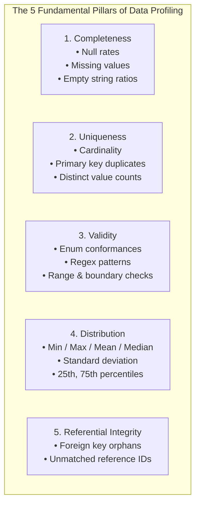

# Data Profiling: The 5 Fundamental Quality Pillars

Before transforming, aggregating, or loading raw data into production data marts, you must **profile** it. Data profiling is the systematic, statistical assessment of a dataset's content, structure, and quality.

---

## 1. The 5 Pillars of Enterprise Data Profiling

### Pillar 1: Completeness
- **Definition**: Does the dataset contain all required values, or are there gaps?
- **Key Metrics**:
  - `total_rows`: Count of all observed rows.
  - `null_count`: Number of missing or `NaN` values per column.
  - `completeness_pct`: $\frac{\text{total\_rows} - \text{null\_count}}{\text{total\_rows}} \times 100\%$
- **Enterprise Threshold**: In core transactional data, primary identifiers (`case_id`, `created_at`) must maintain **100% completeness**. Non-critical text (`description`) may permit lower thresholds (e.g. $\ge 80\%$).

### Pillar 2: Uniqueness
- **Definition**: Are designated primary keys truly distinct, or do duplicate entries exist?
- **Key Metrics**:
  - `distinct_count`: Count of unique values.
  - `duplicate_count`: Number of redundant rows with the same key.
  - `uniqueness_pct`: $\frac{\text{distinct\_count}}{\text{total\_rows}} \times 100\%$
- **Enterprise Rule**: In any operational entity table, the natural primary key must have an exact `uniqueness_pct == 100.0%`.

### Pillar 3: Validity
- **Definition**: Do values conform to declared business domains, formats, and allowable sets?
- **Key Metrics**:
  - `invalid_count`: Rows containing values outside the allowed domain.
  - `validity_pct`: $\frac{\text{total\_rows} - \text{invalid\_count}}{\text{total\_rows}} \times 100\%$
- **Examples**:
  - `status` must only contain `{'OPEN', 'IN_PROGRESS', 'RESOLVED', 'CLOSED'}`.
  - `priority` must only contain `{'LOW', 'MEDIUM', 'HIGH', 'CRITICAL'}`.

### Pillar 4: Statistical Distribution
- **Definition**: What does the statistical spread of numerical and temporal data look like?
- **Key Metrics**:
  - `min`, `max`: Detect extreme outliers (e.g. negative resolution hours or timestamps from the year 1970).
  - `mean`, `median` ($Q2$): Measure central tendency. Large skew between mean and median indicates extreme outliers.
  - `p25`, `p75`: Interquartile ranges ($IQR = Q3 - Q1$) for outlier detection.

### Pillar 5: Referential Integrity
- **Definition**: Do foreign key relationships resolve to valid records in upstream master/reference tables?
- **Key Metrics**:
  - `orphan_count`: Records whose foreign key does not exist in the referenced table.
  - `referential_match_pct`: $\frac{\text{matching\_rows}}{\text{total\_rows}} \times 100\%$
- **Example**: In our pipeline, every case's `created_by` and `assigned_to` must resolve to an existing `user_id` in `reference.json`.

---

## 2. Why Automated Profiling is Mandatory in Production

1. **Catches Silent Producer Drifts**: If an upstream frontend introduces a new case priority `'URGENT'`, automated profiling catches the validity drop before it reaches downstream ML models.
2. **Defends SLA Contracts**: Early profiling prevents corrupted batches from polluting clean analytical stores.
3. **Auditable Artifacts**: In highly regulated industries (finance, healthcare), regulatory auditors require historic profiling reports proving data cleanliness before quarterly executive reports were published.
