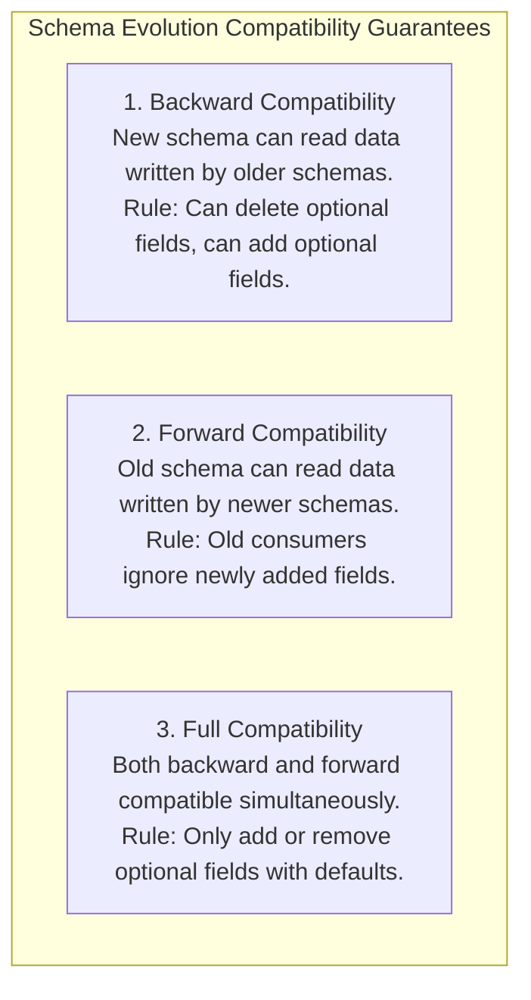

# Schema Design & Schema Evolution: Backward, Forward, and Full Compatibility

In production software and data platforms, schemas are never static. As business requirements change, engineering teams add fields, rename columns, deprecate old types, and alter validations.

**Schema Evolution** is the discipline of managing schema changes over time without breaking existing data producers or downstream data consumers.

---

## 1. The Three Compatibility Guarantees



### A. Backward Compatibility
- **Definition**: Code running on **Schema V2** can successfully read and process data produced on **Schema V1**.
- **Allowed Changes**:
  - Adding optional columns (with a default value).
  - Deleting optional columns.
- **Breaking Changes**:
  - Adding a **mandatory required column** without a default value (Schema V2 will fail when reading V1 records that lack that field).

### B. Forward Compatibility
- **Definition**: Code running on **Schema V1** can successfully read and process data produced on **Schema V2**.
- **Allowed Changes**:
  - Adding new fields, provided old consumers are designed to ignore unknown keys.
- **Breaking Changes**:
  - Deleting a required column that Schema V1 strictly expects.

### C. Full Compatibility
- **Definition**: Guaranteed both ways. Allows rolling deployments where microservices or pipeline jobs are upgraded in any order.

---

## 2. Breaking vs Non-Breaking Changes in Data Pipelines

| Schema Modification | Classification | Impact on Downstream Pipelines |
|---|:---:|---|
| **Add optional column `tags: List[str] = []`** | ✅ Non-Breaking | Downstream jobs safely ignore or default it. |
| **Broaden numeric type (`Int32` $\rightarrow$ `Int64`)** | ✅ Non-Breaking | No data truncation or precision loss. |
| **Add required column without default** | ❌ Breaking | Downstream pipelines crash on null validation. |
| **Rename column (`assigned_to` $\rightarrow$ `assignee_id`)** | ❌ Breaking | Downstream queries fail with `KeyError: 'assigned_to'`. |
| **Narrow numeric type (`Float64` $\rightarrow$ `Int32`)** | ❌ Breaking | Decimals truncated, potential integer overflow. |
| **Alter Enum Set (Remove allowed status `'CLOSED'`)** | ❌ Breaking | Existing historic records fail validity checks. |

---

## 3. How Our Pipeline Tolerates Schema Evolution

In `pipeline/schemas/contracts.py`, our `DataContract` engine is designed with **tolerant schema evolution**:

```python
def validate(self, df: pd.DataFrame) -> Tuple[bool, List[str]]:
    violations: List[str] = []

    # 1. Enforce only declared required columns
    for col in self.required_columns:
        if col not in df.columns:
            violations.append(f"Missing required contract column: '{col}'")

    # Extra columns (e.g. newly introduced upstream fields) are tolerated!
    # They pass contract validation and flow safely through to raw storage.
    return len(violations) == 0, violations
```

This prevents the pipeline from catastrophically halting whenever upstream frontend teams add telemetry tags or experimental feature flags to incoming payloads.
