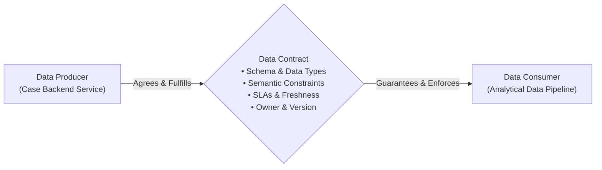

# Data Contracts: Producer-Consumer Agreements and Drift Detection

In modern data architectures (especially Data Mesh), **Data Contracts** solve one of the greatest pain points in data engineering: upstream engineering teams silently changing database schemas or API payloads, which breaks downstream analytical dashboards and machine learning models.

---

## 1. What is a Data Contract?

A **Data Contract** is a formal, version-controlled agreement between a **Data Producer** (e.g., the Case Management backend service) and a **Data Consumer** (e.g., the analytics, reporting, or AI pipeline).



A complete Data Contract specifies:
1. **Model & Types**: Column names, expected data types, and nullability.
2. **Semantics & Constraints**: Allowed enum sets, primary keys, range limits (`created_at <= resolved_at`).
3. **Freshness SLAs**: Maximum tolerable delay between event occurrence and pipeline landing.
4. **Ownership**: The software team responsible for producer changes and incident resolution.

---

## 2. Data Contract Specification in Code

In `pipeline/schemas/contracts.py`, we define contracts as declarative Python dataclasses:

```python
from dataclasses import dataclass, field
from typing import Any, Dict, List

@dataclass
class DataContract:
    dataset_name: str
    version: str
    required_columns: List[str]
    column_types: Dict[str, str] = field(default_factory=dict)
    primary_keys: List[str] = field(default_factory=list)
    allowed_values: Dict[str, List[Any]] = field(default_factory=dict)
    nullable_columns: List[str] = field(default_factory=list)
    description: str = ""
```

### Case Management Source Contract Example:
```python
CASE_SOURCE_CONTRACT = DataContract(
    dataset_name="cases_source",
    version="1.0.0",
    required_columns=[
        "case_id", "title", "status", "priority", 
        "case_type", "created_by", "created_at"
    ],
    primary_keys=["case_id"],
    allowed_values={
        "status": ["OPEN", "IN_PROGRESS", "RESOLVED", "CLOSED"],
        "priority": ["LOW", "MEDIUM", "HIGH", "CRITICAL"],
        "case_type": ["BUG", "FEATURE_REQUEST", "INQUIRY", "COMPLAINT"],
    },
    nullable_columns=["description", "assigned_to", "resolved_at"],
    description="Operational Case Management ingestion contract",
)
```

---

## 3. Automated Drift Detection & Enforcement

When incoming data is ingested, `SchemaValidator(contract).validate(df)` checks every record against the contract:
- If a producer drops a required column or renames it, the contract fails immediately.
- If a producer sends an undeclared status enum (e.g., `'TRIAGED'`), the contract engine flags the violation with exact sample counts and values.
- Violations are logged to the **Audit Manifest**, and invalid records are safely quarantined rather than silently ingested into production marts.
