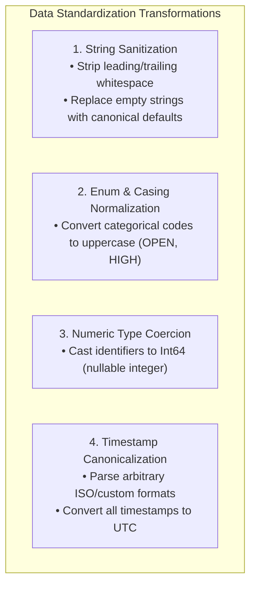

# Data Standardization: Type Coercion, Timestamps, and String Sanitization

Raw data from heterogeneous sources is invariably messy: strings have stray leading/trailing whitespace, casing is inconsistent (`"open"`, `"Open"`, `"OPEN"`), timestamps arrive in varying timezones or string formats, and numeric IDs are stored as floats or strings.

**Data Standardization** is the deterministic process of transforming raw inputs into unified, canonical representations.

---

## 1. The Core Operations of Standardization



---

## 2. Deep Dive: Timestamp Standardization to UTC

One of the most dangerous bugs in distributed data systems is timezone ambiguity. A timestamp like `2026-03-01 10:00:00` without timezone information could be New York (EST, UTC-5), London (GMT, UTC+0), or Tokyo (JST, UTC+9)—a 14-hour difference!

### Best Practice:
Always convert all timestamps to **UTC with explicit timezone metadata** (`datetime64[ns, UTC]`):

```python
import pandas as pd

def standardize_timestamps(df: pd.DataFrame, time_columns: list[str]) -> pd.DataFrame:
    cleaned = df.copy()
    for col in time_columns:
        if col in cleaned.columns:
            # Parse string to UTC datetime; unparseable strings become NaT
            cleaned[col] = pd.to_datetime(cleaned[col], errors="coerce", utc=True)
    return cleaned
```

---

## 3. Production Implementation in Our Pipeline

In `pipeline/transformations/standardization.py`, `standardize_case_records` enforces all standardization rules:

```python
def standardize_case_records(df: pd.DataFrame) -> pd.DataFrame:
    cleaned = df.copy()

    # 1. Clean and trim string fields
    str_cols = ["title", "description", "status", "priority", "case_type"]
    for col in str_cols:
        if col in cleaned.columns:
            cleaned[col] = cleaned[col].astype(str).str.strip()

    # 2. Normalize enums to uppercase
    for col in ["status", "priority", "case_type"]:
        if col in cleaned.columns:
            cleaned[col] = cleaned[col].str.upper()

    # 3. Impute null/empty descriptions
    if "description" in cleaned.columns:
        empty_mask = (cleaned["description"] == "") | cleaned["description"].isna()
        cleaned.loc[empty_mask, "description"] = "No description provided"

    # 4. Cast numeric identifiers using Nullable Integer types
    for id_col in ["case_id", "created_by", "assigned_to"]:
        if id_col in cleaned.columns:
            cleaned[id_col] = pd.to_numeric(cleaned[id_col], errors="coerce").astype("Int64")

    # 5. Parse Timestamps to ISO UTC
    for time_col in ["created_at", "updated_at", "resolved_at"]:
        if time_col in cleaned.columns:
            cleaned[time_col] = pd.to_datetime(cleaned[time_col], errors="coerce", utc=True)

    return cleaned
```

### Why use `Int64` instead of standard `int64`?
In standard NumPy/pandas `int64`, an integer column **cannot contain nulls** (`NaN`). If an unassigned case has `assigned_to = null`, NumPy forces the entire column to float (`float64`), turning `user_id = 5` into `5.0`. Pandas `Int64` (capital 'I') supports nullable integer types natively!
