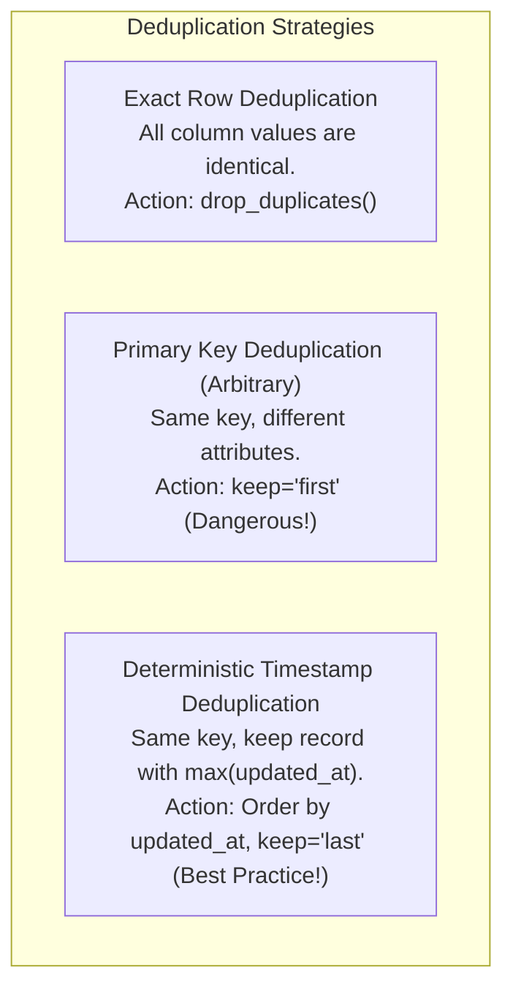

# Deduplication Strategies: Natural Keys, Surrogate Keys, and Keeping the Latest State

Duplicate data is inevitable in distributed data pipelines. Network retries, webhooks firing multiple times, batch re-runs, and unconstrained source exports produce duplicate records.

If duplicates are not removed, analytical queries double-count revenue, skew SLA compliance numbers, and corrupt executive dashboards.

---

## 1. Natural Keys vs Surrogate Keys

- **Natural Key**: A domain identifier that inherently exists in the real world (e.g. `case_id`, `ssn`, `order_number`).
- **Surrogate Key**: A system-generated identifier created by the data warehouse (e.g. auto-incrementing integer or UUID) to uniquely identify a record in a dimensional table.

In operational data pipelines, deduplication is typically evaluated on the **Natural Primary Key** (`case_id`).

---

## 2. Deduplication Strategies



### Why Arbitrary Deduplication is Dangerous
If two records arrive for Case #101:
- Record A: `case_id = 101, status = 'OPEN', updated_at = 10:00 AM`
- Record B: `case_id = 101, status = 'RESOLVED', updated_at = 11:30 AM`

If you arbitrarily run `df.drop_duplicates(subset=['case_id'])` without ordering, you might keep Record A, falsely reporting that a resolved case is still open!

### The Deterministic Standard: Primary Key + Order By Timestamp
Always sort by `[primary_key, timestamp]` ascending, and keep the `last` record:

```python
def deduplicate_cases(
    df: pd.DataFrame,
    primary_key: str = "case_id",
    order_by_col: str = "updated_at",
) -> tuple[pd.DataFrame, int]:
    initial_count = len(df)
    if initial_count == 0 or primary_key not in df.columns:
        return df.copy(), 0

    # 1. Sort so latest timestamp comes last
    if order_by_col in df.columns:
        sorted_df = df.sort_values(by=[primary_key, order_by_col], ascending=[True, True])
    else:
        sorted_df = df

    # 2. Keep the latest occurrence
    deduped = sorted_df.drop_duplicates(subset=[primary_key], keep="last").copy()
    deduped.reset_index(drop=True, inplace=True)

    duplicates_removed = initial_count - len(deduped)
    return deduped, duplicates_removed
```

---

## 3. Reconciliation Accounting of Duplicates

In our enterprise pipeline, every duplicate removed is explicitly counted and balanced in the **Reconciliation Equation**:
$$\text{Curated Count} = \text{Valid Count} - \text{Duplicates Removed}$$

If a pipeline silently drops duplicates without tracking `duplicates_removed`, the source-to-target reconciliation check will fail, triggering an automated integrity alert.
