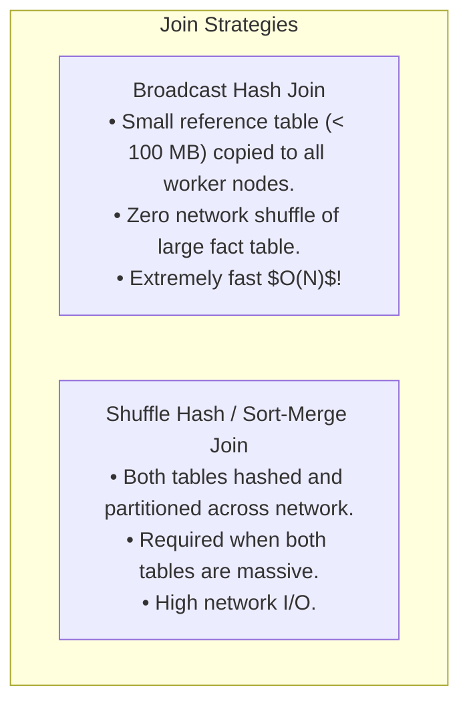

# Relational Enrichment & Joins: Broadcast Joins, Skew, and Business Metrics

Raw transaction records rarely contain all the context required for business intelligence. A case record contains an `assigned_to = 5`, but analysts need to know the assignee's department, support tier, geographic region, and the regulatory SLA policy governing that case type.

**Relational Enrichment** joins raw records with reference lookups to produce business-ready datasets.

---

## 1. Join Mechanics & Performance

In distributed systems (like Spark or DuckDB), joins are among the most expensive operations because they can cause **Data Shuffling** across network nodes.



### In Our Pipeline:
Our case records are enriched via broadcast-style joins against small reference tables:
1. `users_df`: maps `assigned_to` $\rightarrow$ `assignee_tier`, `assignee_region`, `assignee_department_id`.
2. `depts_df`: maps `assignee_department_id` $\rightarrow$ `assignee_department` name.
3. `policies_df`: maps `(case_type, priority)` $\rightarrow$ `sla_target_hours`, `compliance_framework`.

---

## 2. Preventing Join Cardinality Explosions

A disastrous error in ETL pipelines is **Cartesian Multiplication** caused by non-unique join keys:
- If a reference table has duplicate keys for `(case_type='BUG', priority='HIGH')` (e.g. 2 matching policy rows), an `INNER JOIN` or `LEFT JOIN` duplicates every single high-priority bug case in the output!
- If you had 1,000 cases, you now have 2,000 cases. Source-to-target reconciliation immediately fails!

### Prevention Rule:
Always deduplicate reference datasets on the join key before executing the merge:
```python
policy_subset = policies_df[
    ["case_type", "priority", "sla_target_hours", "compliance_framework"]
].drop_duplicates(subset=["case_type", "priority"]).copy()
```

---

## 3. Computing Derived Business Metrics

Once enriched, the pipeline computes critical operational metrics:

### 1. Resolution Time in Hours:
$$\text{Resolution Hours} = \frac{\text{resolved\_at} - \text{created\_at}}{3600 \text{ seconds}}$$
For cases that are still open, resolution time is computed as elapsed time from `created_at` to the current pipeline run timestamp.

### 2. SLA Breach Detection:
$$\text{sla\_breached} = (\text{resolution\_time\_hours} > \text{sla\_target\_hours})$$

These metrics enable real-time operational reporting on compliance violations.
