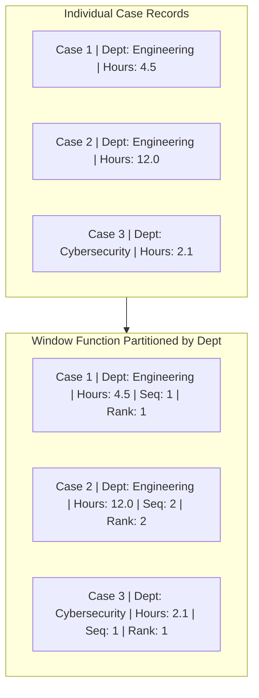

# Window Functions in Data Pipelines: Partitioning, Ordering, and Analytical Rankings

In Week 1, we explored SQL window functions. In Week 2, we implement **Analytical Window Operations** inside our Python/pandas and PySpark data pipelines to generate analytical rankings and cumulative sequences without collapsing individual rows.

---

## 1. Window Functions vs Group By Aggregations

- **`GROUP BY` Aggregation**: Collapses multiple rows into a single summary row per group (e.g. 100 cases $\rightarrow$ 4 priority summary rows).
- **`WINDOW` Function**: Computes metrics across a group (partition) of rows, but **preserves each individual row's identity** and attaches the computed metric as a new column.



---

## 2. Common Window Operations in Data Engineering

### A. Dense Rank Partitioned by Priority:
Ranks cases within each priority group based on resolution speed (fastest to slowest):
```python
df["priority_duration_rank"] = (
    df.groupby("priority")["resolution_time_hours"]
    .rank(method="dense", ascending=True)
    .fillna(0)
    .astype(int)
)
```
- `rank()` vs `dense_rank()`: If two cases tie at rank 1, standard `rank()` assigns rank 3 to the next row (1, 1, 3). `dense_rank()` assigns rank 2 without gaps (1, 1, 2).

### B. Cumulative Sequence Partitioned by Department:
Assigns a running 1-indexed counter to cases within each department:
```python
df["department_case_seq"] = df.groupby("assignee_department").cumcount() + 1
```

### C. Lead / Lag for State Transition Timing:
In audit and telemetry pipelines, `LAG(timestamp)` calculates the time elapsed between subsequent status changes for the same case:
```python
df["prev_status_time"] = df.groupby("case_id")["status_changed_at"].shift(1)
df["status_dwell_hours"] = (df["status_changed_at"] - df["prev_status_time"]).dt.total_seconds() / 3600.0
```

---

## 3. Production Implementation in Our Pipeline

In `pipeline/transformations/windowing.py`, `apply_window_metrics` enriches the standardized case records with both `priority_duration_rank` and `department_case_seq`.

These analytical features allow downstream consumers (BI dashboards, operational managers) to query:
- *"Show me the 5 longest-running unresolved cases in Cybersecurity."*
- *"Show me the cumulative case load assigned to the Infrastructure team today."*
