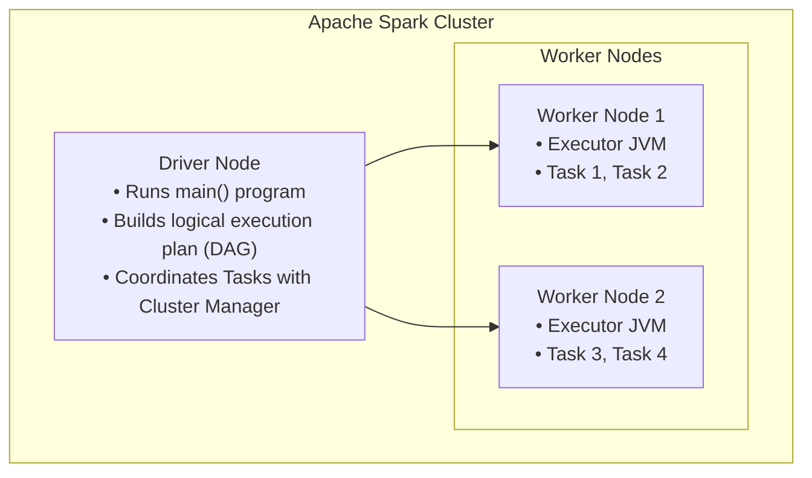

# PySpark Fundamentals: Catalyst Optimizer, Tungsten Engine, and Distributed Transformations

When datasets grow beyond the memory capacity of a single machine (gigabytes to terabytes), single-node tools like pandas become a bottleneck. **Apache Spark** (and its Python API, **PySpark**) is the premier distributed general-purpose computing engine for large-scale data engineering.

---

## 1. Apache Spark Architecture



- **Driver Node**: The central coordinator that parses your code, interacts with the cluster manager, builds the Directed Acyclic Graph (DAG), and schedules tasks.
- **Worker Nodes & Executors**: JVM processes that store partitions of data in RAM/disk and run distributed computational tasks.

---

## 2. Core PySpark Concepts

### 1. Resilient Distributed Datasets (RDDs) vs DataFrames
- **RDD**: Spark's low-level abstraction: a fault-tolerant collection of objects partitioned across nodes. Lacks schema optimization.
- **DataFrame**: High-level abstraction: distributed collection of rows organized into named columns (like a relational table or pandas DataFrame), backed by Catalyst and Tungsten optimizations.

### 2. Catalyst Optimizer & Tungsten Engine
- **Catalyst Optimizer**: Analyzes your code, pushes down query filters (`WHERE`), eliminates unneeded columns (`SELECT`), and reorders joins into the mathematically most efficient execution plan before running anything.
- **Tungsten Engine**: Bypasses JVM garbage collection by managing off-heap binary memory directly and compiling query stages into optimized bytecode at runtime.

### 3. Transformations vs Actions & Lazy Evaluation
- **Transformations (Lazy)**: Operations that produce a new DataFrame (`filter()`, `select()`, `groupBy()`, `join()`). Spark does **not** execute them immediately; it merely records them into an execution plan (DAG).
- **Actions (Eager)**: Operations that trigger actual distributed computation and return results to the driver or write to storage (`count()`, `collect()`, `write.parquet()`, `show()`).

---

## 3. Hands-On PySpark Transformation Lab

In `pipeline/transformations/pyspark_lab.py`, we provide a standalone PySpark script implementing our Case Management transformations:

```python
from pyspark.sql import SparkSession
from pyspark.sql import functions as F
from pyspark.sql.window import Window

def run_pyspark_case_pipeline(input_csv: str, output_parquet: str):
    spark = SparkSession.builder \
        .appName("CaseManagementPySparkPipeline") \
        .master("local[*]") \
        .getOrCreate()

    # 1. Ingest Raw CSV
    df = spark.read.option("header", "true").csv(input_csv)

    # 2. Standardize & Cleanse
    cleaned_df = df.withColumn("case_id", F.col("case_id").cast("long")) \
                   .withColumn("status", F.upper(F.trim(F.col("status")))) \
                   .withColumn("priority", F.upper(F.trim(F.col("priority")))) \
                   .withColumn("created_at", F.to_utc_timestamp(F.col("created_at"), "UTC"))

    # 3. Deduplicate (Keep latest updated_at)
    window_spec = Window.partitionBy("case_id").orderBy(F.col("updated_at").desc())
    deduped_df = cleaned_df.withColumn("row_num", F.row_number().over(window_spec)) \
                           .filter(F.col("row_num") == 1) \
                           .drop("row_num")

    # 4. Write Curated Parquet
    deduped_df.write.mode("overwrite").parquet(output_parquet)
    spark.stop()
```

This demonstrates how our pandas pipeline architecture translates directly to enterprise-scale distributed Spark clusters.
