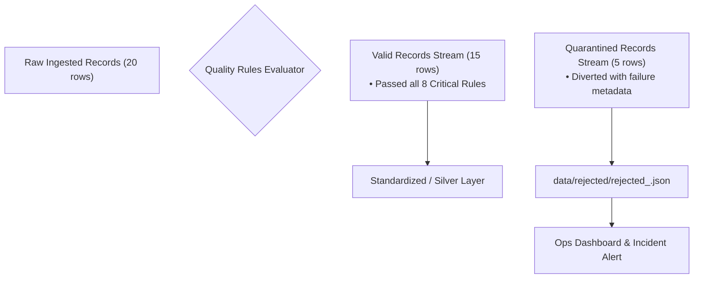

# Quarantine & Rejected-Record Handling: Architecture, Schema, and Dead-Letter Sinks

In traditional, naive data pipelines, encountering an invalid record often leads to one of two disastrous outcomes:
1. **The Pipeline Crashes**: An exception is raised, halting processing for all 500,000 clean records because of 1 corrupted row.
2. **Silent Ingestion or Drop**: The bad record is silently overwritten with `null` or silently discarded without an audit trail, corrupting historical analysis.

Enterprise pipelines solve this dilemma using a **Quarantine Architecture** (also known as a **Dead-Letter Queue / Sink**).

---

## 1. Quarantine Architecture Overview



### Key Engineering Principles:
1. **Non-Blocking Resilience**: 15 clean records continue through to the Curated Gold layer without delay.
2. **Zero Data Loss**: Not a single byte of rejected data is deleted or lost.
3. **Actionable Root-Cause Metadata**: Quarantined records include the exact rule breached, reason string, pipeline run ID, batch ID, and timestamp.

---

## 2. Quarantined Record Payload Schema

In `pipeline/quarantine/quarantine_manager.py`, quarantined records are persisted as structured JSON:

```json
{
  "run_id": "RUN_20260916_120000",
  "batch_id": "BATCH_20260916_1200",
  "quarantined_at": "2026-09-16T12:00:05.123456+00:00",
  "total_quarantined": 2,
  "rejected_records": [
    {
      "original_record": {
        "case_id": "16",
        "title": "Corrupted Status Bug",
        "status": "UNKNOWN_VAL",
        "priority": "HIGH",
        "case_type": "BUG",
        "created_by": "1",
        "assigned_to": "2",
        "created_at": "2026-03-01T10:00:00Z"
      },
      "source": "cases.csv",
      "run_id": "RUN_20260916_120000",
      "rule_id": "RULE-CASE-002",
      "rule_description": "Case status must match domain enum (OPEN, IN_PROGRESS, RESOLVED, CLOSED)",
      "reason": "Status 'UNKNOWN_VAL' not in allowed enum ['OPEN', 'IN_PROGRESS', 'RESOLVED', 'CLOSED']",
      "severity": "CRITICAL",
      "rejected_at": "2026-09-16T12:00:05.123456+00:00"
    }
  ]
}
```

---

## 3. Operational Remediation Workflow

In production, quarantine data feeds an operational feedback loop:
1. **Alerting**: If quarantined count exceeds a threshold (e.g. > 5% of batch), PagerDuty/Slack alerts fire.
2. **Triage**: Data engineers inspect `rejected_<run_id>.json` to determine whether the issue is upstream bad input or a schema evolution that requires updating rules.
3. **Replay Capability**: Once corrected, quarantined records can be re-injected into the pipeline without reprocessing the entire dataset.
