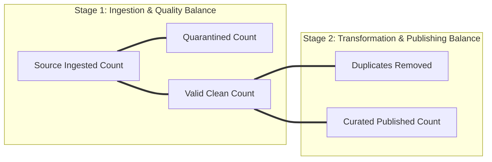

# Source-to-Target Reconciliation: Mathematical Balancing and Zero-Data-Loss Guarantees

In financial, healthcare, and enterprise data platforms, you cannot simply assume that a pipeline processed all records correctly. You must **mathematically prove it**.

**Source-to-Target Reconciliation** is the automated audit process that balances record counts across every transformation boundary, providing a definitive mathematical guarantee that no record was silently dropped, lost in a join, or duplicated.

---

## 1. The Mathematical Balancing Equations

In our enterprise pipeline, every execution run must satisfy two fundamental balancing equations:



$$\begin{aligned}
\textbf{Equation 1: } & \text{Source Count} = \text{Valid Count} + \text{Quarantined Count} \\
\textbf{Equation 2: } & \text{Curated Count} = \text{Valid Count} - \text{Duplicates Removed}
\end{aligned}$$

### What Each Discrepancy (Variance) Signifies:
- **`Source Variance > 0`**: Data Leakage. Records disappeared inside the validation engine (e.g. unhandled null pointer or un-caught exception).
- **`Source Variance < 0`**: Ingestion Phantom. Records were counted multiple times during read.
- **`Curated Variance != 0`**: Join Multiplication or Filter Leakage. A join inadvertently multiplied rows, or an undocumented filter dropped clean rows.

---

## 2. Production Implementation in `ReconciliationEngine`

In `pipeline/reconciliation/reconciler.py`, the engine calculates variances and generates both machine-readable JSON and human-readable Markdown:

```python
class ReconciliationEngine:
    def reconcile(
        self,
        run_id: str,
        source_name: str,
        source_count: int,
        quarantined_count: int,
        valid_count: int,
        duplicates_removed: int,
        curated_count: int,
    ) -> Dict[str, Any]:
        expected_curated = valid_count - duplicates_removed
        source_balance = source_count - (valid_count + quarantined_count)
        curated_balance = curated_count - expected_curated

        is_source_balanced = (source_balance == 0)
        is_curated_balanced = (curated_balance == 0)
        overall_status = "PASS" if (is_source_balanced and is_curated_balanced) else "FAIL"

        return {
            "run_id": run_id,
            "overall_status": overall_status,
            "counts": {
                "source_count": source_count,
                "quarantined_count": quarantined_count,
                "valid_count": valid_count,
                "duplicates_removed": duplicates_removed,
                "curated_count": curated_count,
            },
            "variance": {
                "source_variance": source_balance,
                "curated_variance": curated_balance,
            },
            "balance_check": {
                "source_balanced": is_source_balanced,
                "curated_balanced": is_curated_balanced,
            }
        }
```

---

## 3. Real Execution Verification

In our verified test execution of `cases.csv`:
- **Source Count**: 20
- **Quarantined Count**: 5 (corrupted status, empty title, negative ID, invalid creator, unparseable date)
- **Valid Clean Count**: 15 ($20 = 15 + 5$, **Variance = 0 $\rightarrow$ BALANCED**)
- **Duplicates Removed**: 1 (case_id 1 had an older duplicate row)
- **Curated Published**: 14 ($14 = 15 - 1$, **Variance = 0 $\rightarrow$ BALANCED**)
- **Overall Reconciliation Status**: `🟢 PASS`
