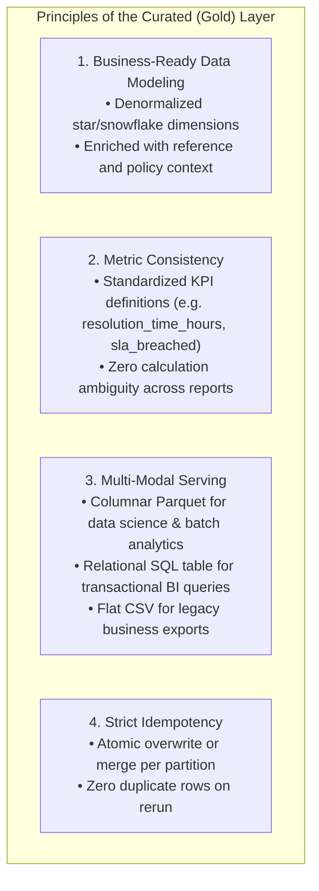

# Medallion Architecture: The Curated (Gold) Layer

The **Curated Layer** (also termed the **Gold Layer**, **Consumption Tier**, or **Analytics Mart**) is the apex of the Medallion Architecture. Its mission is to deliver fully modeled, enriched, aggregated, and optimized data products directly consumable by business users, BI dashboards, executive reports, and downstream AI/ML models.

---

## 1. Principles of the Curated Layer



### Contrast with Silver:
- **Silver** holds normalized, cleansed records representing operational reality.
- **Gold** transforms those records into domain-specific business data products. It answers business questions: *Which department is breaching SLAs? What is our mean time to resolve (MTTR) by case priority?*

---

## 2. Multi-Format Publishing Strategy

In production enterprise platforms, different consumers require different access protocols:
1. **Data Science / AI / Spark**: Need fast columnar reads $\rightarrow$ **Apache Parquet** (`curated_cases.parquet`).
2. **BI Dashboards / SQL Analysts**: Need indexed relational queries $\rightarrow$ **SQL Table** (`curated_cases` in SQLite/PostgreSQL).
3. **Operations / Spreadsheet Users**: Need flat file exports $\rightarrow$ **CSV** (`curated_cases.csv`).

---

## 3. Production Implementation in `CuratedLayerManager`

In `pipeline/layers/curated.py`, our `CuratedLayerManager` coordinates multi-format publishing:

```python
from pathlib import Path
from typing import Optional
import pandas as pd
from sqlalchemy import create_engine

class CuratedLayerManager:
    """Manages the Curated (Gold) Business-Ready Tier."""

    def __init__(self, curated_dir: Path, database_url: Optional[str] = None):
        self.curated_dir = Path(curated_dir)
        self.curated_dir.mkdir(parents=True, exist_ok=True)
        self.database_url = database_url

    def publish_curated_data(
        self,
        df: pd.DataFrame,
        dataset_name: str,
        publish_db: bool = True,
    ) -> Path:
        out_dir = self.curated_dir / dataset_name
        out_dir.mkdir(parents=True, exist_ok=True)

        # 1. Publish High-Performance Parquet
        parquet_file = out_dir / f"curated_{dataset_name}.parquet"
        df.to_parquet(parquet_file, engine="pyarrow", compression="snappy", index=False)

        # 2. Publish Business CSV Export
        csv_file = out_dir / f"curated_{dataset_name}.csv"
        df.to_csv(csv_file, index=False)

        # 3. Publish to Relational Database (SQL Serving)
        if publish_db and self.database_url:
            engine = create_engine(self.database_url)
            with engine.begin() as conn:
                # Idempotent overwrite to prevent duplicate rows on pipeline rerun
                df.to_sql(
                    f"curated_{dataset_name}",
                    conn,
                    if_exists="replace",
                    index=False,
                )

        return parquet_file
```

By publishing to Parquet, CSV, and the relational database in a single atomic stage, the pipeline satisfies all enterprise consumer personas simultaneously.
