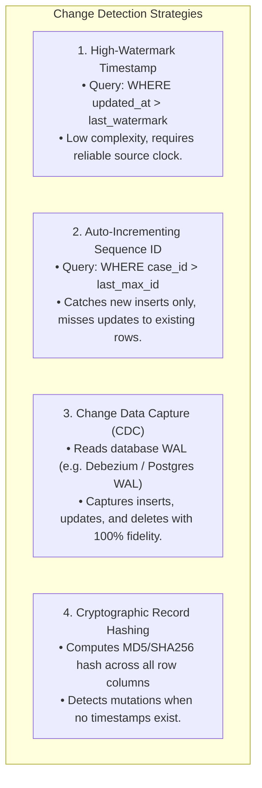

# Incremental Processing: Full Reload vs Delta Ingestion and Change Tracking

As transactional datasets grow into millions of rows, running a **Full Reload** (re-ingesting and re-processing the entire dataset from scratch on every run) becomes computationally unsustainable.

**Incremental Processing** (also called **Delta Ingestion**) ingests only the records that were created or modified since the last successful pipeline run.

---

## 1. Full Reload vs Incremental Ingestion Comparison

| Metric | Full Reload (`mode="full"`) | Incremental Processing (`mode="incremental"`) |
|---|---|---|
| **Data Scope** | 100% of all historic and current rows | Only newly inserted or updated rows ($\Delta$) |
| **Compute Cost** | Grows linearly $O(N)$ with total historical data | Remains constant $O(\Delta)$ proportional to daily activity |
| **Execution Time** | Increases every week/month | Consistent and fast (seconds to minutes) |
| **Complexity** | Simple: truncate and reload target table | Requires state management (high-watermark or CDC) |
| **Failure Recovery** | Simple: re-run the entire batch | Requires watermark rewind and idempotent merges |

---

## 2. Change Tracking Strategies in Enterprise Systems

How does a pipeline determine which records are new or modified?

---

## 3. The High-Watermark Pattern

The most common incremental pattern in batch ETL is the **High-Watermark**:
1. At the start of Run $N$, read the persisted high-watermark timestamp $T_{\text{last}}$ (e.g. `2026-03-01T10:00:00Z`).
2. Query the source for records where `updated_at > T_{\text{last}}`.
3. Process the delta records through validation, quality rules, and enrichment.
4. Calculate the new maximum timestamp $T_{\text{new}} = \max(\text{delta\_records.updated\_at})$.
5. **Only after all stages succeed and reconciliation passes**, update the persistent watermark state to $T_{\text{new}}$.

If the pipeline fails mid-run, the watermark is **not updated**, ensuring the next execution automatically retries the uncommitted delta records.
