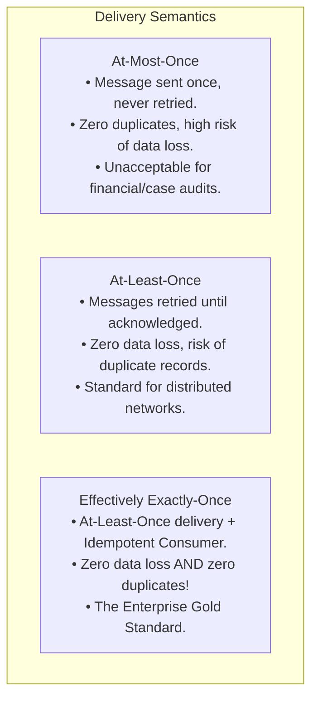

# Idempotency in Data Pipelines: At-Least-Once vs Exactly-Once and Rerun Safety

One of the most essential architectural properties of an enterprise data pipeline is **Idempotency**.

---

## 1. Mathematical & Engineering Definition

$$\Large f(f(x)) = f(x)$$

An operation is **Idempotent** if executing it multiple times produces the exact same system state as executing it once.

### What Happens When a Pipeline Lacks Idempotency?
Imagine an automated daily ETL pipeline runs at 02:00 AM. Halfway through loading cases into the database, the network connection resets. 
- An on-call engineer wakes up and triggers a manual rerun at 02:30 AM.
- If the pipeline uses naive `INSERT INTO curated_cases`:
  - The first 5,000 cases that loaded before the crash are inserted **again**.
  - Monthly metrics show double the actual volume. Case counts and financial rollups are completely corrupted.

---

## 2. Ingestion Semantics: At-Least-Once vs Exactly-Once



To achieve **Effectively Exactly-Once** processing, we accept that networks deliver data *at least once*, and we guarantee that our pipeline transformations and writes are *strictly idempotent*.

---

## 3. Idempotent Writing Patterns in Storage

### Pattern 1: Atomic Partition Overwrites (Parquet / Lakehouse)
When writing files to the Curated tier, write to a temporary staging path, then atomically swap or replace the target partition:
```python
# Atomic overwrite of target partition
df.to_parquet(target_path, engine="pyarrow", compression="snappy", index=False)
```

### Pattern 2: SQL Table Replacement / Upsert (`MERGE INTO`)
In SQLite or PostgreSQL, write with deterministic replace or primary key upserts:
```python
# Full reload replacement
df.to_sql("curated_cases", conn, if_exists="replace", index=False)
```
In distributed SQL warehouses (Snowflake, Databricks Delta Lake, BigQuery), use `MERGE`:
```sql
MERGE INTO curated_cases target
USING delta_cases source
ON target.case_id = source.case_id
WHEN MATCHED THEN
  UPDATE SET target.title = source.title, target.status = source.status, target.updated_at = source.updated_at
WHEN NOT MATCHED THEN
  INSERT (case_id, title, status, updated_at) VALUES (source.case_id, source.title, source.status, source.updated_at);
```

---

## 4. Idempotency Verification in Our Pipeline

In `tests/pipeline/test_orchestration.py`, `test_pipeline_rerun_idempotency` formally proves that running the pipeline twice back-to-back with the same input produces identical record counts (`count1 == count2 == 14`) and maintains balanced zero-variance reconciliation.
