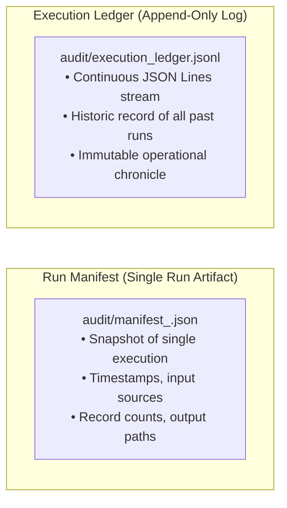

# Audit Manifests, Execution Ledgers, and Data Lineage

In high-assurance enterprise systems, code execution must be transparent and forensic. If an auditor asks, *"Why did our quarterly report show 14 cases on September 16th? What code generated it? Which files were ingested?"*, an engineer cannot reply, *"I ran a script on my laptop."*

You must provide a cryptographic, immutable **Audit Manifest** and **Execution Ledger**.

---

## 1. Run Manifests vs Execution Ledgers



### 1. The Run Manifest (`manifest_<run_id>.json`)
Generated per pipeline invocation. Contains complete execution telemetry:
- `run_id`: Unique execution identifier (e.g. `RUN_20260916_120000`).
- `batch_id`: Ingestion batch identifier.
- `start_time` & `end_time`: UTC timestamps and total duration.
- `status`: `PASS` or `FAIL`.
- `sources_ingested`: List of source names, formats, file paths, and ingested record counts.
- `counts`: Mathematical balance breakdown (`source_count`, `quarantined_count`, `valid_count`, `duplicates_removed`, `curated_count`).
- `output_locations`: Exact paths to landed Parquet, CSV, reports, and quarantine files.

### 2. The Execution Ledger (`execution_ledger.jsonl`)
An append-only line-delimited JSON stream where each completed run appends a one-line summary. Monitoring tools (Datadog, Splunk, Elastic) ingest this ledger to graph pipeline duration and success rates over time.

---

## 2. Production Implementation in `AuditManager`

In `pipeline/audit/audit_manager.py`, the `AuditManager` automates both artifacts:

```python
class AuditManager:
    def __init__(self, audit_dir: Path):
        self.audit_dir = Path(audit_dir)
        self.audit_dir.mkdir(parents=True, exist_ok=True)
        self.ledger_file = self.audit_dir / "execution_ledger.jsonl"

    def create_manifest(
        self,
        run_id: str,
        batch_id: str,
        start_time: datetime,
        end_time: datetime,
        status: str,
        sources_ingested: List[Dict[str, Any]],
        counts: Dict[str, Any],
        output_locations: Dict[str, str],
        error_message: Optional[str] = None,
    ) -> Path:
        manifest_path = self.audit_dir / f"manifest_{run_id}.json"
        duration_seconds = round((end_time - start_time).total_seconds(), 3)

        payload = {
            "run_id": run_id,
            "batch_id": batch_id,
            "start_time": start_time.isoformat(),
            "end_time": end_time.isoformat(),
            "duration_seconds": duration_seconds,
            "status": status,
            "error_message": error_message,
            "sources_ingested": sources_ingested,
            "counts": counts,
            "output_locations": output_locations,
        }

        # 1. Write Run Manifest JSON
        with open(manifest_path, "w", encoding="utf-8") as f:
            json.dump(payload, f, indent=2, default=str)

        # 2. Append to Execution Ledger JSONL
        ledger_entry = {
            "timestamp": end_time.isoformat(),
            "run_id": run_id,
            "status": status,
            "duration_seconds": duration_seconds,
            "curated_records": counts.get("curated_count", 0),
            "quarantined_records": counts.get("quarantined_count", 0),
        }
        with open(self.ledger_file, "a", encoding="utf-8") as f:
            f.write(json.dumps(ledger_entry, default=str) + "\n")

        return manifest_path
```

This guarantees complete regulatory compliance and non-repudiation across all data processing activities.
