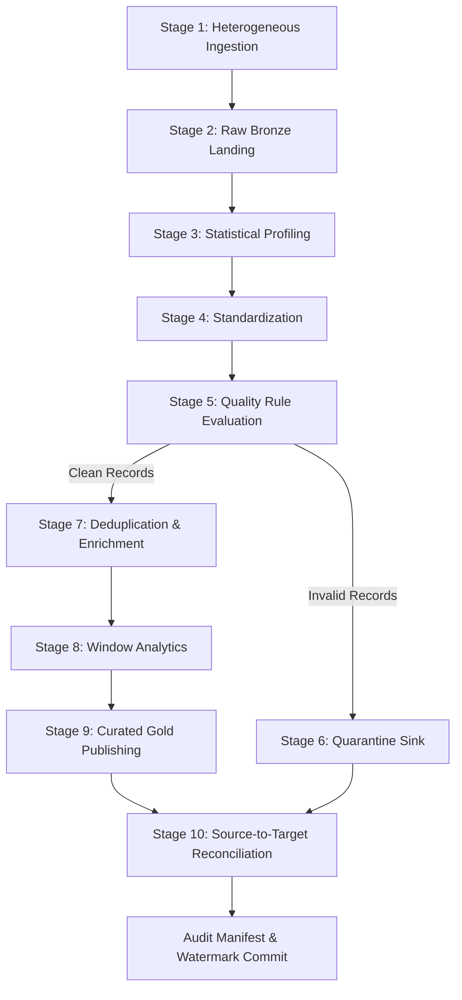

# Pipeline Orchestration: DAG Design, Stage Dependencies, and State Coordination

In an enterprise data system, individual components (sources, profiler, quality rules, joins, reconciler) must not be run as disconnected, manual scripts. They must be coordinated by an **Orchestration Engine** that manages stage dependencies, handles state propagation, and isolates errors.

---

## 1. What is a DAG (Directed Acyclic Graph)?

An orchestration workflow is modeled as a **Directed Acyclic Graph (DAG)**:
- **Directed**: Execution flows along defined edges from parent tasks to child tasks ($A \rightarrow B$).
- **Acyclic**: There are no circular dependencies or infinite loops ($A \rightarrow B \rightarrow A$ is illegal).



---

## 2. Orchestration Tools: Airflow, Prefect, Dagster, and Native Python

| Orchestrator | Paradigm | Key Strengths |
|---|---|---|
| **Apache Airflow** | Task-based Python DAGs | Industry standard for enterprise schedule-driven batch workflows |
| **Prefect** | Flow & Task decorator-based | Modern Python ergonomics, hybrid cloud execution |
| **Dagster** | Software-defined Asset-based | Deep focus on data assets, schemas, and partition awareness |
| **Native Python Orchestrator** | Class-based State Machine | Zero external infrastructure dependencies, embeddable, fast testing |

In Week 2, we implement a **Native Python Orchestrator** (`CaseManagementPipeline` in `pipeline/orchestration/pipeline.py`), structuring the exact 10-stage DAG that an Airflow or Dagster pipeline executes in production.

---

## 3. The 10-Stage Orchestration Lifecycle

```python
class CaseManagementPipeline:
    def run(self, mode: Optional[str] = None, run_id: Optional[str] = None) -> Dict[str, Any]:
        # Stage 1: Ingest Sources (CSV, JSON, Parquet, API)
        # Stage 2: Land Raw Data into Bronze Parquet
        # Stage 3: Profile Statistical Quality (5 Pillars)
        # Stage 4: Standardize Types & Formats
        # Stage 5: Evaluate 8 Critical Quality Rules
        # Stage 6: Divert & Persist Quarantined Records
        # Stage 7: Deduplicate & Enrich via Relational Joins
        # Stage 8: Apply Window Metrics & Rankings
        # Stage 9: Publish Curated Tier (Parquet, CSV, SQLite)
        # Stage 10: Reconcile Source-to-Target Counts & Persist Manifest
```

By encapsulating all 10 stages into a single cohesive class with deterministic inputs and outputs, the entire pipeline can be triggered from a command-line interface (`python -m pipeline.cli`), run within a Docker container, or scheduled by Apache Airflow.
