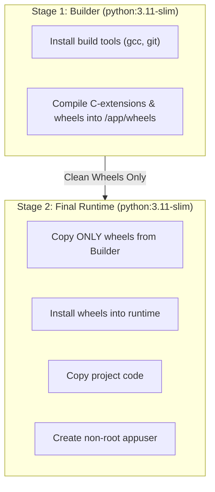

# Containerization with Docker: Multi-Stage Builds, Layer Caching, and Non-Root Security

In enterprise data platforms, pipelines must run reliably across developer laptops, CI/CD testing runners, and cloud production environments (Kubernetes, AWS ECS, GCP Cloud Run) without suffering from *"It works on my machine!"* issues.

**Docker** packages the pipeline code, runtime dependencies, system libraries, and configuration into an immutable, portable **Container Image**.

---

## 1. Multi-Stage Docker Builds

A common beginner mistake is shipping build tools (compilers, wheel caches, temporary setup scripts) inside the final production container, bloating the image to over 1.5 GB and creating security vulnerabilities.

A **Multi-Stage Build** separates the build environment from the lean runtime container:



---

## 2. Layer Caching & Build Optimization

Docker caches build steps in layers. Steps that change frequently (like your source code) must come **after** steps that change rarely (like `requirements.txt` or `pyproject.toml`).

```dockerfile
# 1. Copy dependency manifest FIRST
COPY pyproject.toml .

# 2. Install dependencies (Cached unless pyproject.toml changes!)
RUN pip install --no-cache-dir .

# 3. Copy application code LAST (Fast builds on every code commit)
COPY app/ app/
COPY pipeline/ pipeline/
```

---

## 3. Production Non-Root Security

By default, Docker containers run as the `root` user (UID 0). If a vulnerability exists in a Python package or web framework, an attacker can gain root access to the host kernel.

### Production Rule:
Always create an unprivileged service account and switch to it:
```dockerfile
RUN groupadd -r appuser && useradd -r -g appuser appuser
USER appuser
```

---

## 4. Our Project's Production Dockerfile

Our `Dockerfile` implements multi-stage builds, non-root user execution, and defaults to running the pipeline CLI:

```dockerfile
FROM python:3.11-slim AS runtime

ENV PYTHONUNBUFFERED=1 \
    PYTHONDONTWRITEBYTECODE=1 \
    APP_ENV=production

WORKDIR /app

# Install dependencies
COPY pyproject.toml .
RUN pip install --no-cache-dir .

# Copy application & pipeline code
COPY app/ app/
COPY pipeline/ pipeline/
COPY data/input/ data/input/

# Security: non-root user
RUN groupadd -r appuser && useradd -r -g appuser appuser && \
    mkdir -p data/raw data/standardized data/curated data/rejected reports audit && \
    chown -R appuser:appuser /app

USER appuser

# Default command runs full enterprise pipeline
ENTRYPOINT ["python", "-m", "pipeline.cli"]
CMD ["--mode", "full"]
```
