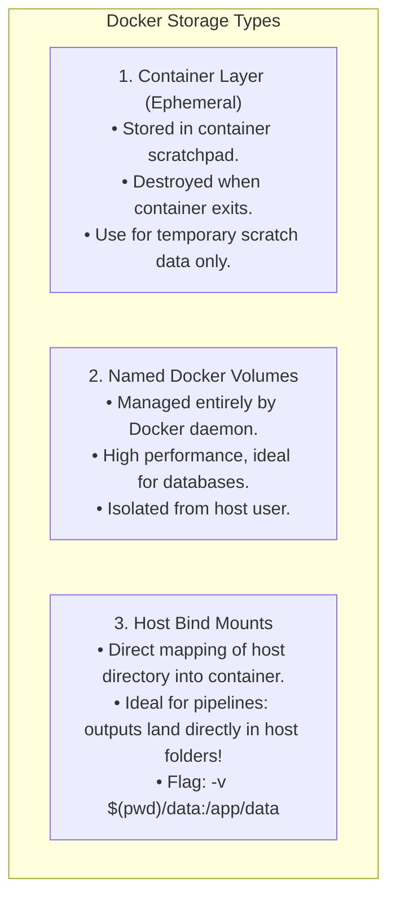

# Docker Volumes, Bind Mounts, and Container Networking

A Docker container's internal filesystem is **ephemeral**: when the container terminates or is recreated, all data written inside it vanishes.

For a data pipeline that writes curated Parquet files, reconciliation reports, and audit logs, data must persist on the host filesystem or network storage.

---

## 1. Storage Options: Ephemeral vs Volumes vs Bind Mounts



---

## 2. Executing the Pipeline with Bind Mounts

To run the containerized pipeline while persisting outputs directly to your host machine:

```bash
docker run --rm \
  -v $(pwd)/data:/app/data \
  -v $(pwd)/reports:/app/reports \
  -v $(pwd)/audit:/app/audit \
  case-management-pipeline:latest \
  --mode full
```

### Breaking Down the Flags:
- `--rm`: Automatically deletes the container instance when execution finishes, freeing host RAM and disk.
- `-v $(pwd)/data:/app/data`: Mounts the host `data/` folder into the container's `/app/data` folder. Landed Parquet and CSV files immediately appear on the host.
- `--mode full`: Passes arguments directly to `python -m pipeline.cli`.

---

## 3. Container Networking & Docker Compose

When running the pipeline alongside mock APIs or PostgreSQL databases in containers:
- Containers on the same Docker network resolve each other by container name (e.g. `http://case-api:8000`).
- The pipeline configuration accepts `MOCK_API_URL` via environment variables (following the 12-Factor App methodology):

```bash
docker run --rm \
  --network case-network \
  -e MOCK_API_URL="http://case-api:8000/api/v1/mock/policies" \
  case-management-pipeline:latest
```
