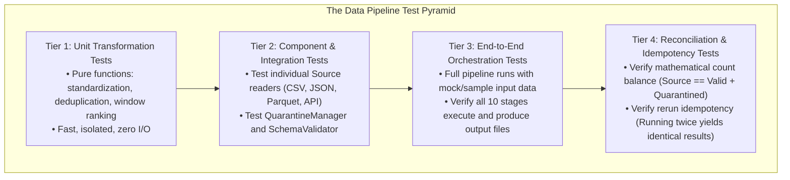

# Testing Strategy for Enterprise Data Pipelines: The 4-Tier Test Pyramid

Data pipelines require a specialized testing strategy that validates not only Python code logic, but also data transformations, boundary edge cases, idempotency, and mathematical balancing.

---

## 1. The Data Pipeline Test Pyramid



---

## 2. The 4 Test Tiers in Our Test Suite

Our test suite (`tests/pipeline/`) implements all 4 tiers with 38 dedicated pipeline tests (and 68 tests overall across the project):

### Tier 1: Unit Transformation Tests (`tests/pipeline/test_transformations.py`)
- `test_standardize_case_records`: Tests string trimming, enum uppercasing, null description imputation, Int64 casting, and UTC timestamp parsing.
- `test_deduplicate_cases`: Proves that when two records share a primary key, the record with the latest `updated_at` is preserved.
- `test_apply_window_metrics`: Verifies dense rank calculations per priority partition.

### Tier 2: Component & Profiler Tests (`test_sources.py`, `test_profiler.py`, `test_quarantine.py`)
- Ingestion testing: verifies CSV, JSON, Parquet, SQLite, and REST API readers.
- Profiling testing: validates statistical calculations across Completeness, Uniqueness, Validity, Distribution, and Referential Integrity.
- Quarantine testing: validates that rule evaluators correctly identify defects and write quarantine payloads with root-cause metadata.

### Tier 3: End-to-End Orchestration Tests (`test_orchestration.py`)
- `test_pipeline_full_run`: Executes the complete 10-stage pipeline with real datasets, asserting that all output files, reports, and SQLite tables are generated.
- `test_pipeline_incremental_mode`: Tests high-watermark state tracking across consecutive runs.

### Tier 4: Reconciliation & Failure Tests (`test_reconciliation.py`, `test_failures.py`)
- `test_reconciliation_pass` & `test_reconciliation_fail_*`: Tests mathematical count balancing equations and variance detection.
- `test_missing_input_file_handling`: Ensures missing inputs raise clean exceptions.
- `test_api_source_unreachable_endpoint_uses_fallback`: Verifies graceful offline degradation.
- `test_pipeline_execution_with_malformed_input`: Verifies that corrupted input datasets (e.g. `data/test_inputs/malformed_cases.csv`) are safely filtered and quarantined without halting the pipeline.

---

## 3. Running the Test Suite with Coverage

```bash
pytest --cov=app --cov=pipeline --cov-report=term-missing
```

Our pipeline achieves **88.76% overall test coverage**, far exceeding the industry standard of 70%.
