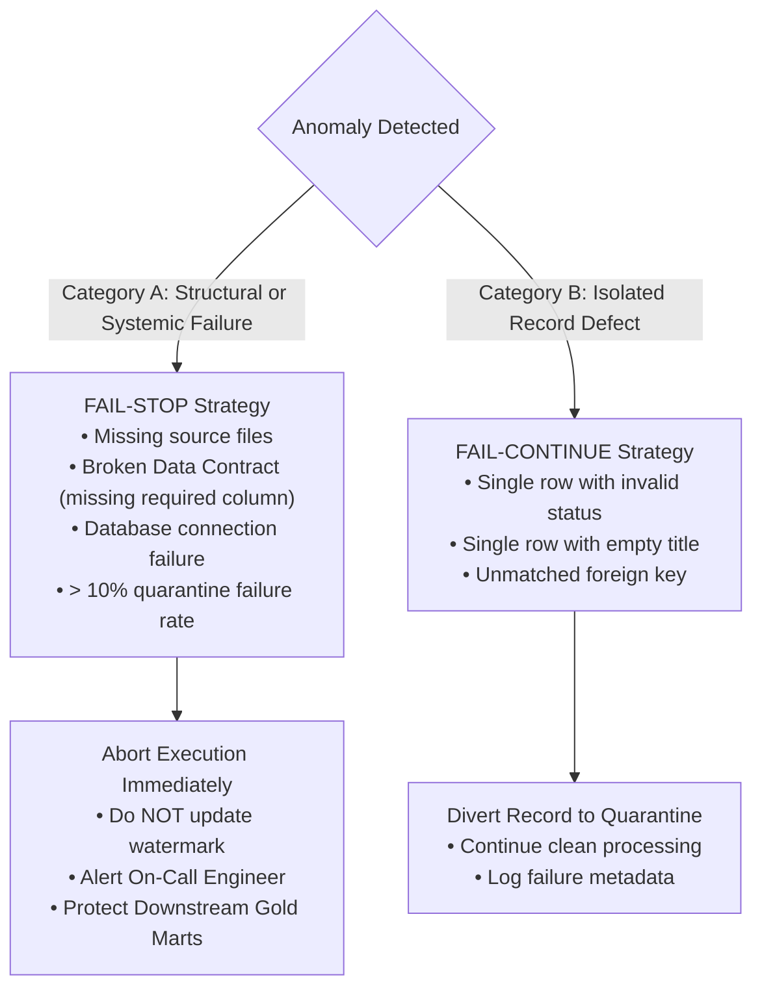

# Error Handling & Resilience: Fail-Stop vs Fail-Continue, Circuit Breakers, and Graceful Degradation

Enterprise data systems operate under hostile network and data conditions: remote microservices experience outages, source CSVs arrive with corrupted headers, and database connections drop.

Designing for resilience means deciding when a pipeline must **halt immediately** versus when it should **degrade gracefully and continue**.

---

## 1. Fail-Stop vs Fail-Continue



### The 10% Circuit Breaker Rule
If 1 record out of 100,000 has a missing title, the pipeline should isolate that record in quarantine and continue processing the 99,999 clean records.

However, if 20,000 records out of 100,000 fail validation (a 20% failure rate), this is **not a random data defect**—it signifies that an upstream system changed its schema or format without warning! A resilient pipeline trips a **Circuit Breaker** and aborts execution to prevent flooding the quarantine sink.

---

## 2. Graceful Degradation in API Ingestion

When our pipeline calls the external REST policy API (`http://127.0.0.1:8000/api/v1/mock/policies`), the network or service might be temporarily unavailable.

Rather than crashing the entire pipeline, `APISource` implements **Graceful Degradation with Cached Fallback**:
```python
try:
    resp = requests.get(self.endpoint_url, timeout=self.timeout_seconds)
    if resp.status_code == 200:
        return pd.DataFrame(resp.json())
except Exception:
    # Service unreachable; fall back to locally cached policy metadata
    if self.fallback_data:
        return pd.DataFrame(self.fallback_data)
```
The pipeline logs a warning and proceeds using the last known good policy metadata.
