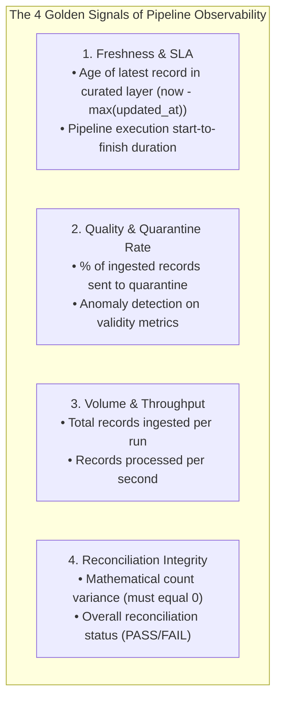

# Production Monitoring: Metrics, Telemetry, and Alerting in Data Pipelines

Deploying a data pipeline into production is only the beginning. Without active observability, silent failures, throughput regressions, and data quality degradation go unnoticed until executive stakeholders report incorrect figures.

---

## 1. The 4 Golden Signals of Data Pipeline Observability



---

## 2. Telemetry Ingestion via Execution Ledger

In our pipeline, every run automatically appends a telemetry event to `audit/execution_ledger.jsonl`:

```json
{"timestamp": "2026-09-16T12:00:05Z", "run_id": "RUN_20260916_120000", "status": "PASS", "duration_seconds": 0.45, "curated_records": 14, "quarantined_records": 5}
```

This telemetry stream is ingested by monitoring platforms (Datadog, Grafana, CloudWatch) to power:
1. **Execution Duration Heatmaps**: Catch slow queries before SLAs are breached.
2. **Quarantine Volume Spikes**: Detect upstream software bugs in real time.
3. **Reconciliation Failure Alerts**: Send immediate PagerDuty alerts if `status == "FAIL"`.
