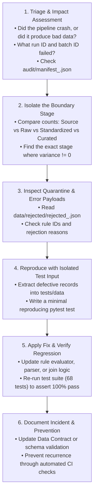

# Pipeline Debugging Methodology: The 6-Step Root-Cause Analysis Framework

When an enterprise data pipeline fails in production or reconciliation reports an unbalanced count variance, panic is the enemy. A systematic, disciplined debugging framework isolates the root cause rapidly and permanently.

---

## 1. The 6-Step Debugging Framework

---

## 2. Common Pipeline Failure Patterns & Fixes

### Pattern 1: Source-to-Target Variance Mismatch (`Source != Valid + Quarantined`)
- **Root Cause**: An unhandled exception or un-caught condition in the validation loop silently dropped records without adding them to either `valid_indices` or `rejected_records`.
- **Debugging Action**: Check `QualityRulesEvaluator.evaluate()`. Ensure every row evaluated either satisfies all rules or appends to `rejected_records`.

### Pattern 2: Curated Record Inflation (`Curated > Valid`)
- **Root Cause**: A relational join had duplicate keys in the dimension/reference table (Cartesian product multiplication).
- **Debugging Action**: Inspect `join_case_reference_and_policies()`. Verify that reference lookup subsets are deduplicated with `.drop_duplicates(subset=[join_keys])` before merging.

### Pattern 3: Watermark Advancing After Failure
- **Root Cause**: The watermark update function was called before data publishing and reconciliation passed.
- **Debugging Action**: Verify that `watermark_tracker.update_watermark()` is placed strictly at the end of the orchestration sequence, guarded by `if reconciliation_status == "PASS"`.
