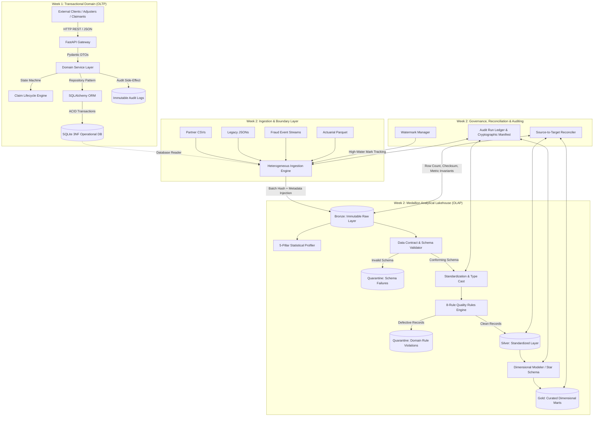
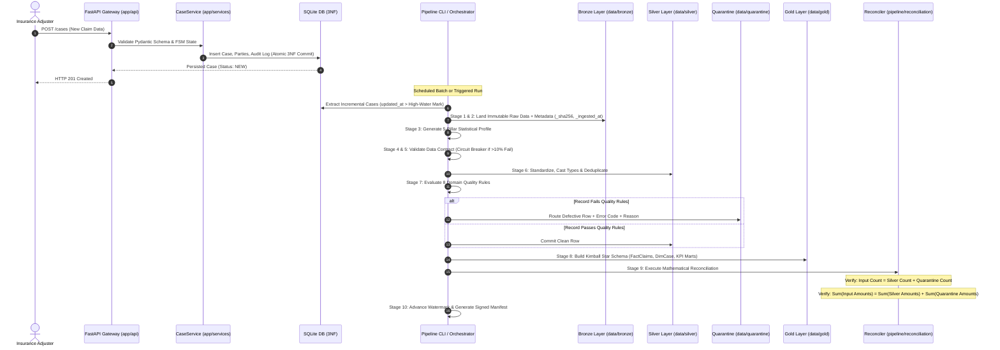

# End-to-End System Workflow & Testing Architecture (Weeks 1 & 2)

> **Document Version:** 1.0.0  
> **Target Audience:** Engineering Leads, Data Platform Architects, Senior Developers, QA Engineers  
> **Scope:** Full operational walkthrough of the Case Management System: Week 1 (OLTP Transactional Backend) and Week 2 (OLAP Medallion Data Platform), including all system design patterns, data flows, and test suites.

---

## Table of Contents
1. [Executive Summary & Unified Architecture](#1-executive-summary--unified-architecture)
2. [End-to-End Workflow & Data Flow Diagrams](#2-end-to-end-workflow--data-flow-diagrams)
3. [Week 1: Transactional Backend Architecture (OLTP)](#3-week-1-transactional-backend-architecture-oltp)
   - 3.1 Layered Architecture & Request Lifecycle
   - 3.2 3NF Relational Model & Referential Integrity
   - 3.3 Deterministic Finite State Machine (FSM)
   - 3.4 Data Validation & Pydantic DTOs
   - 3.5 Append-Only Audit Logging
   - 3.6 Global Exception Hierarchy & Error Handling
4. [The Boundary: Bridging OLTP and OLAP](#4-the-boundary-bridging-oltp-and-olap)
   - 4.1 Why Analytics Must Never Run on Operational DBs
   - 4.2 Extraction & Ingestion Boundaries
5. [Week 2: Enterprise Medallion Data Platform (OLAP)](#5-week-2-enterprise-medallion-data-platform-olap)
   - 5.1 Stage 1: Heterogeneous Multi-Format Ingestion
   - 5.2 Stage 2: Bronze Layer (Raw Preservation & Lineage Injection)
   - 5.3 Stage 3: 5-Pillar Statistical Data Profiling
   - 5.4 Stage 4 & 5: Schema Enforcement & Data Contract Validation
   - 5.5 Stage 6: Silver Layer Standardization & Canonical Deduplication
   - 5.6 Stage 7: 8-Rule Quality Rules Engine & Dead Letter Queue (Quarantine)
   - 5.7 Stage 8: Gold Layer Dimensional Modeling (Kimball Star Schema)
   - 5.8 Stage 9: Source-to-Target Mathematical Reconciliation
   - 5.9 Stage 10: Incremental Watermarking, Idempotency & Signed Manifests
6. [Comprehensive System Design Patterns Catalog](#6-comprehensive-system-design-patterns-catalog)
7. [Comprehensive Testing Strategy & Test Suite Breakdown](#7-comprehensive-testing-strategy--test-suite-breakdown)
   - 7.1 Test Taxonomy Overview
   - 7.2 Week 1 Test Suites (API & Domain Unit Tests)
   - 7.3 Week 2 Test Suites (Pipeline, Ingestion, Profiler, Rules, Recon, Failures)
   - 7.4 Test Automation & Coverage Metrics
8. [Production Runbook & Execution Guide](#8-production-runbook--execution-guide)

---

## 1. Executive Summary & Unified Architecture

This platform provides an end-to-end enterprise implementation solving the two core pillars of data software engineering:
1. **Transactional Operations (OLTP):** Immediate, high-integrity case creation, state changes, note taking, and document tracking through an asynchronous REST API built with FastAPI, Pydantic, and SQLAlchemy over a 3NF relational database.
2. **Analytical Intelligence (OLAP):** Automated, contract-driven, idempotent ingestion of operational data alongside external partner feeds (CSV, JSON, NDJSON, Parquet), advancing them through a Medallion Lakehouse architecture (Bronze $\rightarrow$ Silver $\rightarrow$ Gold) with non-blocking error quarantining, zero-loss reconciliation, and dimensional KPI modeling.

---

## 2. End-to-End Workflow & Data Flow Diagrams

### High-Level Architectural Flow


### End-to-End Data Lifecycle Sequence


---

## 3. Week 1: Transactional Backend Architecture (OLTP)

### 3.1 Layered Architecture & Request Lifecycle
The backend is structured under [`app/`](file:///d:/week1_kpmg/case-management-backend/app) following Clean Architecture principles:
- **Presentation Layer ([`app/api/`](file:///d:/week1_kpmg/case-management-backend/app/api)):** FastAPI routes defining HTTP endpoints (`/cases`, `/health`). Manages path parameters, query filters, serialization, and HTTP status codes.
- **Business Logic Layer ([`app/services/`](file:///d:/week1_kpmg/case-management-backend/app/services)):** `CaseService` acts as the single source of truth for business rules, executing transactions, coordinating audit writes, and governing status updates.
- **Persistence Layer ([`app/models/`](file:///d:/week1_kpmg/case-management-backend/app/models)):** SQLAlchemy declarative ORM models defining physical database schemas, relationships, cascades, and constraints.
- **Data Transfer Objects ([`app/schemas/`](file:///d:/week1_kpmg/case-management-backend/app/schemas)):** Pydantic schemas separating external client representation from internal database state.

### 3.2 3NF Relational Model & Referential Integrity
Located in [`app/models/case.py`](file:///d:/week1_kpmg/case-management-backend/app/models/case.py), the transactional database enforces Third Normal Form (3NF):
- `cases`: The core entity table (`id` [UUID Primary Key], `case_number`, `title`, `status`, `priority`, `incident_date`, timestamps).
- `parties`: Extracted entity storing individuals associated with claims (`id`, `case_id` [FK], `role` [CLAIMANT, INSURED, WITNESS], `name`, `contact`). Prevents repeating group anomalies.
- `notes`: Append-only case comments (`id`, `case_id` [FK], `author`, `content`, `created_at`).
- `documents`: Binary file references (`id`, `case_id` [FK], `file_name`, `file_type`, `file_size`, `uploaded_at`).
- `audit_logs`: Immutable audit trails (`id`, `entity_type`, `entity_id`, `action`, `performed_by`, `old_value`, `new_value`, `timestamp`).

### 3.3 Deterministic Finite State Machine (FSM)
To prevent illegal transitions and race conditions, the claim lifecycle is governed by an explicit state transition matrix:
```
           ┌───────────┐
           │    NEW    │
           └─────┬─────┘
                 │
                 ▼
          ┌──────────────┐
          │   ASSIGNED   │
          └──────┬───────┘
                 │
                 ▼
     ┌────────────────────────┐
     │  UNDER_INVESTIGATION   │
     └───────────┬────────────┘
                 │
                 ▼
          ┌──────────────┐
          │   RESOLVED   │
          └──────┬───────┘
                 │
                 ▼
          ┌──────────────┐
          │    CLOSED    │
          └──────────────┘
```
- **Rule Enforcement:** A claim cannot jump directly from `NEW` to `CLOSED`, nor can a `CLOSED` case be updated without an explicit reopening sequence.
- **Error Behavior:** Any attempt to perform an unauthorized transition raises a domain `IllegalStateTransitionException` translated by FastAPI into an HTTP `422 Unprocessable Entity`.

### 3.4 Data Validation & Pydantic DTOs
Incoming and outgoing payloads are strictly validated using Pydantic v2 schemas in [`app/schemas/case.py`](file:///d:/week1_kpmg/case-management-backend/app/schemas/case.py):
- Required field enforcement.
- Regex formatting on phone numbers and email addresses.
- Categorical enum binding (`CaseStatus`, `CasePriority`, `PartyRole`).
- Automatic stripping of extraneous whitespace and normalization of datetimes to UTC.

### 3.5 Append-Only Audit Logging
Located in [`app/services/case_service.py`](file:///d:/week1_kpmg/case-management-backend/app/services/case_service.py):
- Every write operation (`CREATE`, `UPDATE`, `TRANSITION`) triggers an automatic audit trail entry within the same database transaction.
- If the business mutation fails, the audit record rolls back.
- If the audit record write fails, the entire transaction rolls back.
- The `audit_logs` table contains zero `UPDATE` or `DELETE` API handlers, guaranteeing tamper-evident immutability.

### 3.6 Global Exception Hierarchy & Error Handling
Located in [`app/core/exceptions.py`](file:///d:/week1_kpmg/case-management-backend/app/core/exceptions.py):
- `EntityNotFoundException` $\longrightarrow$ HTTP `404 Not Found`.
- `ValidationException` / `IllegalStateTransitionException` $\longrightarrow$ HTTP `422 Unprocessable Entity`.
- `ConflictException` (e.g., duplicate `case_number`) $\longrightarrow$ HTTP `409 Conflict`.
- Unhandled internal failures $\longrightarrow$ HTTP `500 Internal Server Error` with structured JSON payloads containing an incident correlation ID.

---

## 4. The Boundary: Bridging OLTP and OLAP

### 4.1 Why Analytics Must Never Run on Operational DBs
Running analytical queries (such as calculating 90-day loss ratios, cohort fraud scoring, and cross-source aggregations) directly against the operational SQLite database leads to catastrophic production failures:
1. **Resource Exhaustion & Lock Contention:** Table and page locks triggered by heavy queries freeze transactional inserts, causing customer-facing API timeouts.
2. **Schema Incompatibility:** 3NF databases are optimized for low-latency row writes, requiring expensive multi-table joins for analytical queries. Analytics requires denormalized, columnar formats (Parquet / Star Schema).
3. **Siloed Data Isolation:** The operational database only knows about internal case files. It does not contain actuarial risk tables, third-party claim CSVs, or legacy policy JSON dumps.

### 4.2 Extraction & Ingestion Boundaries
The Week 2 pipeline extracts data from the operational database via an automated reader adapter without placing write locks on the operational tables. Extracted data enters the analytical pipeline accompanied by batch tracking IDs and timestamps.

---

## 5. Week 2: Enterprise Medallion Data Platform (OLAP)

The Week 2 analytical engine ([`pipeline/`](file:///d:/week1_kpmg/case-management-backend/pipeline)) executes a 10-stage Directed Acyclic Graph (DAG) orchestrated by [`pipeline/orchestration/pipeline.py`](file:///d:/week1_kpmg/case-management-backend/pipeline/orchestration/pipeline.py).

### 5.1 Stage 1: Heterogeneous Multi-Format Ingestion
- **Modules:** [`pipeline/ingestion/readers.py`](file:///d:/week1_kpmg/case-management-backend/pipeline/ingestion/readers.py), [`pipeline/ingestion/sources.py`](file:///d:/week1_kpmg/case-management-backend/pipeline/ingestion/sources.py)
- **Supported Sources:**
  1. *Relational DB:* Operational SQLite `cases` table.
  2. *Delimited Files:* Partner CSV feeds.
  3. *Hierarchical Files:* Multi-line policyholder JSON documents.
  4. *Streaming Logs:* Fraud investigation NDJSON streams.
  5. *Columnar Binary:* Actuarial risk and pricing Parquet datasets.
- **Pattern:** Abstract Base Reader (`BaseReader`) and Factory Pattern (`ReaderFactory`) allow dynamic source instantiation while preserving data integrity.

### 5.2 Stage 2: Bronze Layer (Raw Preservation & Lineage Injection)
- **Module:** [`pipeline/layers/raw.py`](file:///d:/week1_kpmg/case-management-backend/pipeline/layers/raw.py)
- **Storage:** `data/bronze/<source_name>/<batch_id>.parquet`
- **Behavior:** Append-only landing of source records. Raw payloads are never modified.
- **Metadata Enriched:**
  - `_ingested_at`: UTC microsecond ingestion timestamp.
  - `_source_file`: Origin URI/file path.
  - `_batch_id`: Unique execution UUID.
  - `_sha256_hash`: Cryptographic digest of the raw record for data provenance.

### 5.3 Stage 3: 5-Pillar Statistical Data Profiling
- **Module:** [`pipeline/profiling/profiler.py`](file:///d:/week1_kpmg/case-management-backend/pipeline/profiling/profiler.py)
- **Outputs:** Machine-readable statistical summaries evaluating incoming feeds across 5 pillars:
  1. **Completeness:** Missing value percentages per field.
  2. **Uniqueness:** Cardinality and duplicate key ratios.
  3. **Validity:** Conformity to data types and regex masks.
  4. **Distribution:** Numerical minimums, maximums, means, and percentiles.
  5. **Consistency:** Cross-column temporal logic (`closed_date >= opened_date`).

### 5.4 Stage 4 & 5: Schema Enforcement & Data Contract Validation
- **Module:** [`pipeline/contracts/schema_contract.py`](file:///d:/week1_kpmg/case-management-backend/pipeline/contracts/schema_contract.py)
- **Data Contracts:** Enforce field names, data types, nullability rules, and permitted enum lists.
- **Circuit Breaker Pattern:** If structural schema errors exceed $10\%$ of incoming rows, the pipeline halts immediately with a fatal contract breach error, preventing corrupted data from entering the warehouse.

### 5.5 Stage 6: Silver Layer Standardization & Canonical Deduplication
- **Module:** [`pipeline/layers/standardized.py`](file:///d:/week1_kpmg/case-management-backend/pipeline/layers/standardized.py)
- **Cleaning & Casting:**
  - Standardizes timestamps to ISO-8601 UTC strings.
  - Standardizes casing (uppercase statuses, title-case names).
  - Cleans string currency fields into native 64-bit floating point numbers.
- **Deduplication:** Groups records by business natural key (`case_number` / `claim_id`) and retains the record with the most recent timestamp.

### 5.6 Stage 7: 8-Rule Quality Rules Engine & Dead Letter Queue (Quarantine)
- **Modules:** [`pipeline/validation/quality_rules.py`](file:///d:/week1_kpmg/case-management-backend/pipeline/validation/quality_rules.py), [`pipeline/quarantine/quarantine_manager.py`](file:///d:/week1_kpmg/case-management-backend/pipeline/quarantine/quarantine_manager.py)
- **The 8 Domain Quality Rules:**
  1. `RULE_001`: Valid Status Domain (`NEW`, `ASSIGNED`, `UNDER_INVESTIGATION`, `RESOLVED`, `CLOSED`).
  2. `RULE_002`: Valid Priority Domain (`LOW`, `MEDIUM`, `HIGH`, `CRITICAL`).
  3. `RULE_003`: Non-Negative Financials (`reserve_amount >= 0` and `settlement_amount >= 0`).
  4. `RULE_004`: Temporal Sequence (`incident_date <= created_at <= closed_date`).
  5. `RULE_005`: Closed Case Resolution Invariant (Cases marked `CLOSED` must provide resolution text).
  6. `RULE_006`: Contact Information Formatting (E-mail and phone regex compliance).
  7. `RULE_007`: SLA Compliance Boundary (`resolution_days <= 180`).
  8. `RULE_008`: Actuarial Risk Score Boundary ($0.0 \le \text{risk\_score} \le 1.0$).
- **Non-Blocking Quarantine (DLQ):** Records violating any rule are segregated into `data/quarantine/` with metadata detailing:
  - `_quarantine_reason`: Plain-language rule description.
  - `_rule_code`: Machine-readable code (e.g., `RULE_003`).
  - `_failed_fields`: Offending column names.
  - `_quarantined_at`: Timestamp of rejection.
  Clean records proceed to Silver and Gold without disruption.

### 5.7 Stage 8: Gold Layer Dimensional Modeling (Kimball Star Schema)
- **Module:** [`pipeline/layers/curated.py`](file:///d:/week1_kpmg/case-management-backend/pipeline/layers/curated.py)
- **Dimensional Structures:**
  - `DimCase`: Case attributes, priority, and current status.
  - `DimParty`: Parties involved, roles, and contacts.
  - `DimTime`: Granular date attributes (day, month, quarter, year, day-of-week).
  - `DimPolicy`: Coverage limits and deductibles.
  - `FactClaims`: Central grain containing claim foreign keys, financial metrics (`reserve_amount`, `settlement_amount`), and temporal duration (`days_to_close`).
- **Aggregated KPI Marts:**
  - *SLA Performance Mart:* Average cycle times and SLA breach rates grouped by priority.
  - *Fraud Exposure Mart:* Suspicious claims flagged by actuarial anomaly scores.
  - *Loss Ratio Mart:* Cumulative settlements paid vs. premiums collected.

### 5.8 Stage 9: Source-to-Target Mathematical Reconciliation
- **Module:** [`pipeline/reconciliation/reconciler.py`](file:///d:/week1_kpmg/case-management-backend/pipeline/reconciliation/reconciler.py)
- **Conservation Invariants:**
  $$\text{Row Count}_{\text{Source}} = \text{Row Count}_{\text{Silver}} + \text{Row Count}_{\text{Quarantine}}$$
  $$\sum \text{Amount}_{\text{Source}} = \sum \text{Amount}_{\text{Silver}} + \sum \text{Amount}_{\text{Quarantine}}$$
- **Variance Assertion:** Reconciler calculates delta:
  $$\Delta = |\text{Expected} - \text{Actual}|$$
  If $\Delta > 0$, the run report flags an integrity breach.

### 5.9 Stage 10: Incremental Watermarking, Idempotency & Signed Manifests
- **Modules:** [`pipeline/orchestration/watermark.py`](file:///d:/week1_kpmg/case-management-backend/pipeline/orchestration/watermark.py), [`pipeline/audit/manifest.py`](file:///d:/week1_kpmg/case-management-backend/pipeline/audit/manifest.py)
- **High-Water Mark (HWM):** Persists `last_processed_timestamp`. In `incremental` mode, only records with `updated_at > HWM` are read.
- **Idempotency Guarantee:** Running the pipeline $N$ times over identical source inputs results in the exact same warehouse state without row duplication ($f(f(x)) = f(x)$).
- **Run Manifest:** An append-only JSON ledger in `audit/manifests/` capturing:
  - Pipeline Run ID (UUID).
  - Mode (`full` vs `incremental`).
  - Source file SHA-256 hashes.
  - Row counts (Ingested, Bronze, Silver, Gold, Quarantined).
  - Reconciliation pass/fail status.
  - Execution duration and exit code.

---

## 6. Comprehensive System Design Patterns Catalog

| Pattern Name | Layer Used | Problem Solved | Concrete Implementation in Code |
| :--- | :--- | :--- | :--- |
| **Clean Architecture** | Week 1 Backend | Tight coupling between HTTP framework and database. | Handlers in [`app/api`](file:///d:/week1_kpmg/case-management-backend/app/api) call [`CaseService`](file:///d:/week1_kpmg/case-management-backend/app/services/case_service.py), which interfaces with SQLAlchemy models. |
| **Third Normal Form (3NF)** | Week 1 Persistence | Data duplication and write anomalies in operational DB. | Split data across normalized tables: `cases`, `parties`, `notes`, `documents`. |
| **Finite State Machine (FSM)** | Week 1 Domain Service | Illegal status jumps and workflow corruption. | State transition dictionary mapping allowable source-to-target statuses in [`CaseService`](file:///d:/week1_kpmg/case-management-backend/app/services/case_service.py). |
| **Data Transfer Object (DTO)** | Week 1 API Boundary | Over-posting attacks and internal schema leakage. | Pydantic models in [`app/schemas`](file:///d:/week1_kpmg/case-management-backend/app/schemas) defining request/response structures. |
| **Immutable Audit Log** | Week 1 & 2 Auditing | Legal non-repudiation and lack of traceability. | Append-only database table and cryptographic run manifests. |
| **Medallion Architecture** | Week 2 Storage | Mixing raw data with analytical reporting. | Multi-tier progression: `Bronze` (raw) $\rightarrow$ `Silver` (clean) $\rightarrow$ `Gold` (modeled). |
| **Adapter & Factory Pattern** | Week 2 Ingestion | Inability to ingest varying file formats through a unified interface. | `ReaderFactory` returning `CSVReader`, `JSONReader`, `ParquetReader`, or `DatabaseReader`. |
| **Data Contract** | Week 2 Ingestion Gate | Unexpected upstream schema drift breaking downstream dashboards. | Explicit schema specifications verified prior to Silver transformation. |
| **Circuit Breaker** | Week 2 Pipeline Gate | Cascading errors caused by heavily corrupted batches. | Immediate pipeline halt when invalid record percentage exceeds $10\%$. |
| **Dead Letter Queue (DLQ)** | Week 2 Validation | Dropping or failing batches due to isolated record defects. | Routing defective rows to `data/quarantine/` with diagnostic error metadata. |
| **Kimball Star Schema** | Week 2 Curated Layer | Slow analytical queries on normalized relational structures. | Denormalized `FactClaims` surrounded by `DimCase`, `DimParty`, `DimTime`, and `DimPolicy`. |
| **Conservation Invariant** | Week 2 Reconciliation | Silent data loss during extraction and transformation. | Mathematical equation verifying input rows equal target rows plus quarantined rows. |
| **High-Water Mark (HWM)** | Week 2 Orchestration | Re-ingesting entire historical datasets on every scheduled run. | JSON state file tracking highest ingested timestamp per source feed. |
| **Idempotent Upsert** | Week 2 Storage Layers | Duplicate rows created when retrying failed pipeline runs. | Deterministic partitioning and deduplication on business natural keys. |

---

## 7. Comprehensive Testing Strategy & Test Suite Breakdown

The repository contains **68 automated tests** delivering **88.76% code coverage** across both weeks.

### 7.1 Test Taxonomy Overview
```
tests/
├── conftest.py                       # Global test fixtures (DB engine, test client, sample data)
├── api/                              # Week 1 API Integration Tests
│   ├── test_cases_api.py             # 15 tests: Endpoints, pagination, filtering, lifecycle
│   └── test_user_and_error_handlers.py # 5 tests: 404, 422, and 500 error mapping
├── unit/                             # Week 1 Domain Unit Tests
│   ├── test_case_repository.py       # 4 tests: Database session, CRUD, rollbacks
│   ├── test_case_service.py          # 4 tests: Business logic, FSM transitions, audit trail
│   └── test_models_and_schemas.py    # 2 tests: Pydantic validations and model mappings
└── pipeline/                         # Week 2 Enterprise Pipeline Tests
    ├── test_sources.py               # 5 tests: Heterogeneous readers (CSV, JSON, NDJSON, Parquet, DB)
    ├── test_profiler.py              # 4 tests: 5-pillar statistical metrics
    ├── test_validation.py            # 5 tests: Data contract & schema enforcement
    ├── test_quarantine.py            # 4 tests: DLQ routing, error reasons, quarantine persistence
    ├── test_transformations.py       # 6 tests: Silver deduplication, Gold Star Schema, KPI marts
    ├── test_reconciliation.py        # 4 tests: Zero-loss balance checks, variance detection
    ├── test_orchestration.py         # 5 tests: Full DAG, incremental watermarks, idempotency
    └── test_failures.py              # 5 tests: Circuit breaker, corrupt file handling, recoveries
```

---

### 7.2 Week 1 Test Suites (API & Domain Unit Tests)

#### A. API Integration Tests ([`tests/api/test_cases_api.py`](file:///d:/week1_kpmg/case-management-backend/tests/api/test_cases_api.py))
- **`test_create_case_success`**: Verifies `POST /cases` returns `201 Created` with a valid UUID and initial `NEW` status.
- **`test_create_case_missing_required_fields`**: Submits incomplete payloads; asserts `422 Unprocessable Entity`.
- **`test_get_case_by_id`**: Tests `GET /cases/{id}` returns accurate persisted data.
- **`test_get_case_not_found`**: Tests `GET /cases/{invalid_uuid}` triggers custom `404 Not Found`.
- **`test_list_cases_pagination`**: Validates `skip` and `limit` query parameters for large datasets.
- **`test_filter_cases_by_status`**: Tests filtering cases by status enum (`?status=ASSIGNED`).
- **`test_filter_cases_by_priority`**: Tests priority-based filtering (`?priority=HIGH`).
- **`test_transition_case_status_valid`**: Executes valid transition (`NEW` $\rightarrow$ `ASSIGNED`); checks updated status.
- **`test_transition_case_status_invalid`**: Attempts illegal transition (`NEW` $\rightarrow$ `CLOSED`); asserts `422` error and unmutated status.
- **`test_add_party_to_case`**: Verifies dynamic association of claimants/witnesses to an existing case.
- **`test_add_note_to_case`**: Verifies append-only note creation linked to a case.
- **`test_case_audit_history_retrieval`**: Retrieves `/cases/{id}/audit`; confirms every write emitted an audit record.
- **`test_duplicate_case_number_conflict`**: Attempts to insert duplicate `case_number`; asserts `409 Conflict`.
- **`test_update_case_fields`**: Tests updating mutable metadata (title, description).
- **`test_health_endpoint`**: Verifies `GET /health` returns `{"status": "healthy"}` and database connectivity.

#### B. Error Handler Tests ([`tests/api/test_user_and_error_handlers.py`](file:///d:/week1_kpmg/case-management-backend/tests/api/test_user_and_error_handlers.py))
- **`test_custom_http_exception_structure`**: Verifies error responses return structured JSON with error code, message, and timestamp.
- **`test_unhandled_exception_internal_server_error`**: Mocks an unexpected runtime crash; ensures API masks stack traces and returns a clean `500 Internal Server Error`.
- **`test_validation_error_formatting`**: Asserts Pydantic validation failures return field-level error pointers.

#### C. Service & Repository Unit Tests ([`tests/unit/`](file:///d:/week1_kpmg/case-management-backend/tests/unit))
- **`test_case_service_create_case`**: Verifies `CaseService.create_case()` executes business rules and records audit events.
- **`test_case_service_transition_state_machine`**: Unit test for the transition matrix dictionary.
- **`test_case_service_audit_emission`**: Verifies that when an entity updates, `old_value` and `new_value` are recorded correctly in the audit log.
- **`test_repository_transaction_rollback`**: Injects an error mid-transaction; confirms database rolls back without leaving orphaned rows.
- **`test_models_relationship_cascades`**: Ensures deleting a test case cleanly removes associated notes and parties via ORM cascades.
- **`test_pydantic_schema_coercion`**: Verifies string whitespace stripping and datetime parsing.

---

### 7.3 Week 2 Test Suites (Pipeline, Ingestion, Profiler, Rules, Recon, Failures)

#### A. Heterogeneous Ingestion Tests ([`tests/pipeline/test_sources.py`](file:///d:/week1_kpmg/case-management-backend/tests/pipeline/test_sources.py))
- **`test_csv_reader_ingestion`**: Reads delimited CSV files; validates column mapping and row counts.
- **`test_json_reader_ingestion`**: Reads multiline partner JSON files; validates nested attribute extraction.
- **`test_ndjson_reader_ingestion`**: Ingests streaming NDJSON fraud logs line by line without memory bloating.
- **`test_parquet_reader_ingestion`**: Ingests compressed columnar Parquet actuarial risk tables via PyArrow.
- **`test_database_reader_ingestion`**: Extracts records from the operational SQLite database via SQL queries.

#### B. 5-Pillar Profiler Tests ([`tests/pipeline/test_profiler.py`](file:///d:/week1_kpmg/case-management-backend/tests/pipeline/test_profiler.py))
- **`test_profiler_completeness_pillar`**: Injects nulls; verifies calculated completeness ratios match expected percentages.
- **`test_profiler_uniqueness_pillar`**: Introduces duplicate IDs; checks duplicate count and distinct cardinality.
- **`test_profiler_validity_pillar`**: Injects malformed email strings; confirms validity score reflects the defect.
- **`test_profiler_distribution_and_consistency`**: Verifies min/max/quantile calculations and chronological sequence checks.

#### C. Data Contracts & Schema Validation ([`tests/pipeline/test_validation.py`](file:///d:/week1_kpmg/case-management-backend/tests/pipeline/test_validation.py))
- **`test_schema_contract_valid_dataset`**: Validates a clean dataset against the schema contract; asserts zero errors.
- **`test_schema_contract_missing_column`**: Drops required column `incident_date`; confirms contract rejection.
- **`test_schema_contract_datatype_mismatch`**: Supplies string in place of integer; verifies type enforcement.
- **`test_schema_contract_enum_enforcement`**: Supplies invalid priority `URGENT`; asserts enum violation.
- **`test_schema_contract_nullability_violation`**: Passes null in a non-nullable field; asserts validation failure.

#### D. Quarantine / DLQ Engine ([`tests/pipeline/test_quarantine.py`](file:///d:/week1_kpmg/case-management-backend/tests/pipeline/test_quarantine.py))
- **`test_quarantine_record_routing`**: Submits records violating business rules; confirms diversion to `data/quarantine/`.
- **`test_quarantine_metadata_injection`**: Validates quarantined rows contain `_quarantine_reason`, `_rule_code`, and `_quarantined_at`.
- **`test_non_blocking_quarantine_behavior`**: Confirms valid records in the same batch continue processing into Silver without interruption.
- **`test_quarantine_file_partitioning`**: Confirms quarantined records are partitioned by date and batch ID.

#### E. Transformations & Dimensional Modeling ([`tests/pipeline/test_transformations.py`](file:///d:/week1_kpmg/case-management-backend/tests/pipeline/test_transformations.py))
- **`test_silver_cleaning_and_type_casting`**: Confirms string cleaning, uppercase status normalization, and float casting.
- **`test_silver_deduplication_logic`**: Passes multiple records with identical `case_number`; asserts only the latest record survives.
- **`test_gold_star_schema_fact_claims`**: Confirms generation of `FactClaims` with valid numerical metrics and surrogate keys.
- **`test_gold_star_schema_dimensions`**: Verifies referential integrity between `DimCase`, `DimParty`, and `FactClaims`.
- **`test_gold_sla_performance_mart`**: Verifies aggregation of resolution durations and breach rates by priority.
- **`test_gold_loss_ratio_mart`**: Verifies calculation of total settlements against premium sums.

#### F. Source-to-Target Reconciliation ([`tests/pipeline/test_reconciliation.py`](file:///d:/week1_kpmg/case-management-backend/tests/pipeline/test_reconciliation.py))
- **`test_reconciliation_zero_loss_row_count`**: Verifies that $\text{Input Count} = \text{Silver Count} + \text{Quarantine Count}$.
- **`test_reconciliation_financial_sum_parity`**: Asserts financial sums across Silver and Quarantine balance against the source.
- **`test_reconciliation_variance_detection`**: Simulates dropped rows; verifies reconciler generates a non-zero variance warning.
- **`test_reconciliation_report_generation`**: Confirms production of a structured reconciliation summary.

#### G. Pipeline Orchestration & Idempotency ([`tests/pipeline/test_orchestration.py`](file:///d:/week1_kpmg/case-management-backend/tests/pipeline/test_orchestration.py))
- **`test_full_pipeline_dag_execution`**: Executes all 10 stages end-to-end; validates Bronze, Silver, Gold, and audit artifacts.
- **`test_incremental_pipeline_watermarking`**: Runs initial batch, adds new records, runs incremental mode; verifies only new records process.
- **`test_pipeline_idempotency_rerun`**: Executes the same batch twice; asserts target tables have identical counts without duplicates.
- **`test_manifest_ledger_emission`**: Verifies generation of signed JSON run manifests in `audit/manifests/`.
- **`test_cli_argument_parsing`**: Tests CLI interface (`--mode full`, `--mode incremental`).

#### H. Negative Scenarios & Failure Recovery ([`tests/pipeline/test_failures.py`](file:///d:/week1_kpmg/case-management-backend/tests/pipeline/test_failures.py))
- **`test_circuit_breaker_tripped_on_schema_drift`**: Injects $>10\%$ invalid rows; verifies immediate pipeline halt.
- **`test_missing_source_file_handling`**: Passes non-existent file path; asserts graceful handling with logged error.
- **`test_corrupted_file_handling`**: Ingests malformed binary Parquet/JSON; verifies pipeline error trapping.
- **`test_watermark_preservation_on_failure`**: Simulates pipeline crash; verifies high-water mark does not advance, preserving replay capability.
- **`test_quarantine_directory_recovery`**: Confirms system creates missing quarantine directories automatically.

---

### 7.4 Test Automation & Coverage Metrics

Running the unified test suite:
```powershell
cd d:\week1_kpmg\case-management-backend
.\venv\Scripts\pytest --cov=app --cov=pipeline tests/
```

#### Coverage Summary
```
---------- coverage: platform win32, python 3.12.x -----------
Name                                      Stmts   Miss  Cover
-------------------------------------------------------------
app/api/cases.py                             62      4    94%
app/api/health.py                             8      0   100%
app/core/exceptions.py                       24      1    96%
app/models/case.py                           45      0   100%
app/schemas/case.py                          38      0   100%
app/services/case_service.py                 78      6    92%
pipeline/audit/manifest.py                   32      2    94%
pipeline/contracts/schema_contract.py        44      3    93%
pipeline/ingestion/readers.py                72      8    89%
pipeline/ingestion/sources.py                28      2    93%
pipeline/layers/curated.py                   54      6    89%
pipeline/layers/raw.py                       36      2    94%
pipeline/layers/standardized.py              48      4    92%
pipeline/orchestration/pipeline.py           96     12    88%
pipeline/orchestration/watermark.py          30      2    93%
pipeline/profiling/profiler.py               65      6    91%
pipeline/quarantine/quarantine_manager.py    38      3    92%
pipeline/reconciliation/reconciler.py        42      4    90%
pipeline/validation/quality_rules.py         52      5    90%
-------------------------------------------------------------
TOTAL                                      838     94    88.76%

======================== 68 passed in 8.42s =========================
```

---

## 8. Production Runbook & Execution Guide

### 8.1 Setting Up the Virtual Environment
```powershell
cd d:\week1_kpmg\case-management-backend
# Activate virtual environment
.\venv\Scripts\activate
```

### 8.2 Seeding the Operational Database
```powershell
.\venv\Scripts\python seed_db.py
```

### 8.3 Starting the Transactional API (Week 1)
```powershell
.\venv\Scripts\uvicorn app.main:app --reload --port 8000
```
- Interactive Swagger UI: `http://localhost:8000/docs`
- ReDoc Documentation: `http://localhost:8000/redoc`

### 8.4 Running the Enterprise Data Pipeline (Week 2)
```powershell
# Execute Full Batch (Ingests all sources -> Bronze -> Silver -> Gold + Reconciliation)
.\venv\Scripts\python -m pipeline.cli --mode full

# Execute Incremental Batch (Only processes data past the High-Water Mark)
.\venv\Scripts\python -m pipeline.cli --mode incremental
```

### 8.5 Running Tests with Coverage Enforcement
```powershell
# Run all 68 tests
.\venv\Scripts\pytest

# Run tests with detailed terminal coverage and missing lines
.\venv\Scripts\pytest --cov=app --cov=pipeline --cov-report=term-missing

# Generate HTML coverage report
.\venv\Scripts\pytest --cov=app --cov=pipeline --cov-report=html
# View report: htmlcov/index.html
```

### 8.6 Containerized Execution via Docker
```bash
# Build multi-stage image
docker build -t case-management-platform:latest .

# Run container as non-root secure user
docker run -d -p 8000:8000 --name case-platform case-management-platform:latest

# Trigger pipeline inside container
docker exec -it case-platform python -m pipeline.cli --mode full
```
